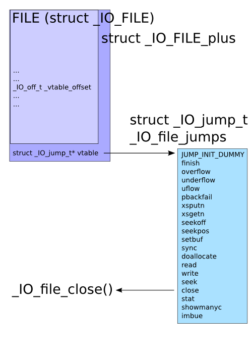
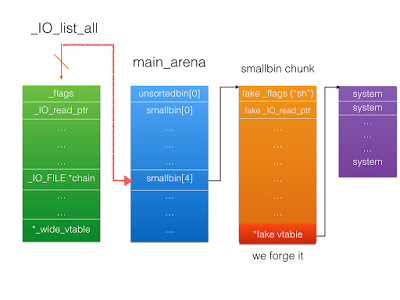

# sice_cream
 
## Problem

> Just pwn this program and get a flag. Connect with nc 2019shell1.picoctf.com 3972. libc.so.6 ld-2.23.so.

* [Program](./sice_cream)

## Solution

### Stage 1: Analysis

1. Test program run:

    ```
    Welcome to the Sice Cream Store!
    We have the best sice cream in the world!
    Whats your name?
    > test
    1. Buy sice cream
    2. Eat sice cream
    3. Reintroduce yourself
    4. Exit
    > 1
    How much sice cream do you want?
    > 3
    What flavor?
    > 3
    Here you go!
    1. Buy sice cream
    2. Eat sice cream
    3. Reintroduce yourself
    4. Exit
    > 2
    Which sice cream do you want to eat?
    > 1
    Yum!
    1. Buy sice cream
    2. Eat sice cream
    3. Reintroduce yourself
    4. Exit
    > 3
    What's your name again?
    > t
    Ah, right! How could a forget a name like t
    st
    !
    1. Buy sice cream
    2. Eat sice cream
    3. Reintroduce yourself
    4. Exit
    > 4
    Too hard? ;)
    ```

2. ``checksec sice_cream``

    ```
    [*] '~/Documents/PicoCTF/Binary Exploitation/sice_cream/sice_cream'
    Arch:     amd64-64-little
    RELRO:    Full RELRO
    Stack:    Canary found
    NX:       NX enabled
    PIE:      No PIE (0x400000)
    RUNPATH:  b'./'
    ```

    `Full RELRO` means the `GOT` is not writeable, which rules out quite a few attack vectors. Having `PIE` disabled is nice though, and suggests that we might need to use a fixed address of some function or global variable in our exploit.

3. Reverse the binary file using [Ghidra](https://ghidra-sre.org/) ([cheat sheet](https://ghidra-sre.org/CheatSheet.html)). `main()` function:

    ```c++
    void FUN_00400b76(void)

    {
    int iVar1;
    ulong uVar2;
    long in_FS_OFFSET;
    char local_28 [24];
    undefined8 local_10;

    local_10 = *(undefined8 *)(in_FS_OFFSET + 0x28);
    setvbuf(stdin,(char *)0x0,2,0);
    setvbuf(stdout,(char *)0x0,2,0);
    puts("Welcome to the Sice Cream Store!");
    puts("We have the best sice cream in the world!");
    puts("Whats your name?");
    printf("> ");
    read(0,&DAT_00602040,0x100);
    while( true ) {
        while( true ) {
        while( true ) {
            FUN_004008e7();
            printf("> ");
            read(0,local_28,0x10);
            uVar2 = strtoul(local_28,(char **)0x0,10);
            iVar1 = (int)uVar2;
            if (iVar1 != 2) break;
            FUN_00400a5b();
        }
        if (2 < iVar1) break;
        if (iVar1 != 1) goto LAB_00400cb5;
        FUN_0040091e();
        }
        if (iVar1 != 3) break;
        FUN_00400b24();
    }
    if (iVar1 == 4) {
        puts("Too hard? ;)");
    }
    LAB_00400cb5:
                        /* WARNING: Subroutine does not return */
    exit(0);
    }
    ```

    `reintroduce()` function:

    ```c++
    void FUN_00400b24(void)

    {
    puts("What\'s your name again?");
    printf("> ");
    read(0,&DAT_00602040,0x100);
    printf("Ah, right! How could a forget a name like %s!\n",&DAT_00602040);
    return;
    }
    ```

    `eat()` function:

    ```c++
    void FUN_00400a5b(void)

    {
    ulong uVar1;
    long in_FS_OFFSET;
    char local_28 [24];
    long local_10;

    local_10 = *(long *)(in_FS_OFFSET + 0x28);
    puts("Which sice cream do you want to eat?");
    printf("> ");
    read(0,local_28,0x10);
    uVar1 = strtoul(local_28,(char **)0x0,10);
    if (0x13 < (uint)uVar1) {
        puts("Invalid index!");
                        /* WARNING: Subroutine does not return */
        exit(-1);
    }
    free(*(void **)(&DAT_00602140 + (uVar1 & 0xffffffff) * 8));
    puts("Yum!");
    if (local_10 != *(long *)(in_FS_OFFSET + 0x28)) {
                        /* WARNING: Subroutine does not return */
        __stack_chk_fail();
    }
    return;
    }
    ```

    `buy()` function:

    ```c++
    void FUN_0040091e(void)

    {
    int iVar1;
    ulong uVar2;
    void *pvVar3;
    long in_FS_OFFSET;
    char local_28 [24];
    long local_10;

    local_10 = *(long *)(in_FS_OFFSET + 0x28);
    iVar1 = FUN_004008a7();
    if (iVar1 < 0) {
        puts("Out of space!");
                        /* WARNING: Subroutine does not return */
        exit(-1);
    }
    puts("How much sice cream do you want?");
    printf("> ");
    read(0,local_28,0x10);
    uVar2 = strtoul(local_28,(char **)0x0,10);
    if (0x58 < (uint)uVar2) {
        puts("That\'s too much sice cream!");
                        /* WARNING: Subroutine does not return */
        exit(-1);
    }
    pvVar3 = malloc(uVar2 & 0xffffffff);
    *(void **)(&DAT_00602140 + (long)iVar1 * 8) = pvVar3;
    puts("What flavor?");
    printf("> ");
    read(0,*(void **)(&DAT_00602140 + (long)iVar1 * 8),uVar2 & 0xffffffff);
    puts("Here you go!");
    if (local_10 != *(long *)(in_FS_OFFSET + 0x28)) {
                        /* WARNING: Subroutine does not return */
        __stack_chk_fail();
    }
    return;
    }
    ```

    `menu()` function:

    ```c++
    void FUN_004008e7(void)

    {
    puts("1. Buy sice cream");
    puts("2. Eat sice cream");
    puts("3. Reintroduce yourself");
    puts("4. Exit");
    return;
    }
    ```

    `printfile()` function (at address `0x00400cc4`):

    ```c++
    void FUN_00400cc4(char *param_1)

    {
    int iVar1;
    FILE *__fp;

    __fp = fopen(param_1,"r");
    if (__fp != (FILE *)0x0) {
        while( true ) {
        iVar1 = _IO_getc((_IO_FILE *)__fp);
        if ((char)iVar1 == -1) break;
        putchar((int)(char)iVar1);
        }
    }
    return;
    }
    ```

    Key takeaways from the source code:

    * We are restricted to `buy`ing pointers of fastbin size (maxing out at 0x58).
    * Eating a sice cream `free`s the respective pointer, but does not `NULL` it out. This looks like the beginning of a double free vulnerability. This is similar to "Bug 1" from the "zero_to_hero" writeup.
    * Global variable `DAT_00602040` (refereed to as `name`, with address `0x00602040`) contains the user provided name and `DAT_00602140` (address `0x00602140`) is an array of `creams` that `buy()` adds to and eat `free`s.
    * `name` is directly above `creams` in memory.
    * If we `reintroduce()` with a `name` of the full length `256`, we can leak the first pointer in `creams`.

### Stage 2: Leak LIBC (fastbin_dup_stack)

1. We can only allocate fastbin size chunks, which will not produce libc pointers. We need to figure out a way to create a smallbin chunk in order to leak libc. Smallbins have a backwards pointer which points to the `main_arena` when the smallbin is at the head of smallbin free list. We can make a fake smallbin chunk since `reintroduce()` gives us full control of `255` bytes (not `256` because of `\n`). However, we need to be able to free this chunk in order to actually see the libc pointers and `free()` is only called on members of the `creams` array. Therefore, we need to put a pointer to our fake smallbin chunk into `creams`.
2. This can be done because we can control `creams` since it is located directly below `name` in memory. While `name` is not vulnerable to an overflow, we can write the header of a fake fastbin chunk into it right above `creams`, thus enabling us to control `creams`.
3. Therefore, we will write the following data into `creams`:

    ```
    [name]
    0x602040:    0x0000000000000000    0x00000000000000c1 <-- fake smallbin chunk header
    0x602050:    0x0000000000000000    0x0000000000000000 <-- fake smallbin chunk data
    0x602060:    0x0000000000000000    0x0000000000000000
    0x602070:    0x0000000000000000    0x0000000000000000
    0x602080:    0x0000000000000000    0x0000000000000000
    0x602090:    0x0000000000000000    0x0000000000000000
    0x6020a0:    0x0000000000000000    0x0000000000000000
    0x6020b0:    0x0000000000000000    0x0000000000000000
    0x6020c0:    0x0000000000000000    0x0000000000000000
    0x6020d0:    0x0000000000000000    0x0000000000000000
    0x6020e0:    0x0000000000000000    0x0000000000000000
    0x6020f0:    0x0000000000000000    0x0000000000000000
    0x602100:    0x00000000000000c1    0x0000000000000031 <-- intermediary chunk header
    0x602110:    0x0000000000000000    0x0000000000000000
    0x602120:    0x0000000000000000    0x0000000000000000
    0x602130:    0x0000000000000000    0x0000000000000041 <-- fake chunk header (above `creams`)
    [creams]
    0x602140:    ...
    ```

4. We can get `malloc` to return the chunk at `0x602130` by abusing the double free vulnerability. We allocate two chunks, A nd B, by executing `buy()`. Then execute `free(A); free(B); free(A)`. The second chunk (chunk B) is necessary to bypass the "double free or corruption (fasttop)" check. The structure of the fastbin for our chosen size now looks like: `head -> A -> B -> A -> tail`. Fastbins are treated as last in, first out (LIFO). We can now poison the forward pointer of chunk A by allocating a chunk of the same size as A and writing our address. Allocating a chunk of the same size as A, will give us the same memory address of A and make the fastbin look like this: `head -> B -> A -> tail`. We write the address of our fake chunk, `0x602130`, to A. Next, we allocate another chunk to remove B from the list: `head -> A -> tail`. The head points to `A`, which we overwrote to the address of our fake chunk header. We now have the ability to write `0x602040` (address of our fake smallbin chunk) into `creams[0]`. More info about the fastbin double free vulnerability at [heap-exploitation.dhavalkapil.com](https://heap-exploitation.dhavalkapil.com/attacks/double_free.html) ([Archive](https://web.archive.org/web/20200611182145/https://heap-exploitation.dhavalkapil.com/attacks/double_free.html)).
5. Now that `creams[0]` points towards our fake smallbin chunk, we can run `eat(0)` to free that chunk, thus placing the chunk in the unsorted bin and writing the location of libc to the backward pointer. If a smallbin is at the head of the list then it will have a backwards pointer which points to the `main_arena`. Therefore, we can leak the libc address by calling `reintroduce(AAAABBBBCCCCDDD)`. We replace the first 16 bytes with non-null characters (since they were null before) because the libc address begins at byte 17. We can now calculate the critical offsets.
6. For more details about this approach visit [Feng's "How to heap?" post](https://blog.fxiao.me/how-to-heap/) ([Archive](https://web.archive.org/web/20200611185539/https://blog.fxiao.me/how-to-heap/)) and [this](https://github.com/shellphish/how2heap/blob/master/glibc_2.25/fastbin_dup_into_stack.c) demo of the "fastbin_dup_into_stack" exploit from [shellphish/how2heap](https://github.com/shellphish/how2heap/blob/master/glibc_2.25/fastbin_dup_into_stack.c) ([Archive](https://web.archive.org/web/20200611185904/https://github.com/shellphish/how2heap/blob/master/glibc_2.25/fastbin_dup_into_stack.c)).

### Stage 3: House of Orange

Once we have leaked the address of libc, we're still very limited. We don't have a write-what-where of any kind. Just as importantly, we don't have a stack leak. However, this binary uses libc version 2.23 which is vulnerable to the "House of Orange" exploit.

Sources to understand the "House of Orange" exploit:

* [ctf-wiki](https://ctf-wiki.github.io/ctf-wiki/pwn/linux/glibc-heap/house_of_orange/), mostly talks about "stage 1", which is not that useful for this challenge ([Archive](https://web.archive.org/web/20200510124851/https://ctf-wiki.github.io/ctf-wiki/pwn/linux/glibc-heap/house_of_orange/))
* [shellphish/how2heap house_of_orange.c](https://github.com/shellphish/how2heap/blob/529d19c57eea87b5bc40310b362af4f106158c9d/glibc_2.25/house_of_orange.c#L127), specifically phase 2 of the attack on line 127 ([Archive](https://web.archive.org/web/20200611191215/https://github.com/shellphish/how2heap/blob/master/glibc_2.25/house_of_orange.c))
* [4ngelboy's blog](https://4ngelboy.blogspot.com/2016/10/hitcon-ctf-qual-2016-house-of-orange.html) ([Archive](https://web.archive.org/web/20200611211649/https://4ngelboy.blogspot.com/2016/10/hitcon-ctf-qual-2016-house-of-orange.html))
* [Post about the FILE structure](https://outflux.net/blog/archives/2011/12/22/abusing-the-file-structure/) ([Archive](https://web.archive.org/web/20170709151306/https://outflux.net/blog/archives/2011/12/22/abusing-the-file-structure/))
* [1ce0ear's post about the House of Orange](https://1ce0ear.github.io/2017/11/26/study-house-of-orange/) ([Archive](https://web.archive.org/web/20200611211841/https://1ce0ear.github.io/2017/11/26/study-house-of-orange/))
* [FSOP (File Stream Oriented Programming) Guide](https://ctf-wiki.github.io/ctf-wiki/pwn/linux/io_file/fsop/) ([Archive](https://web.archive.org/web/20200611213152/https://ctf-wiki.github.io/ctf-wiki/pwn/linux/io_file/fsop/))
* [shellphish/how2heap unsorted_bin_attack.c](https://github.com/shellphish/how2heap/blob/master/glibc_2.26/unsorted_bin_attack.c) ([Archive](https://web.archive.org/web/20200612044333/https://github.com/shellphish/how2heap/blob/master/glibc_2.26/unsorted_bin_attack.c))

This is a complicated exploit, so I recommend reading the above sources since they can probably explain it better than me. Nevertheless, lets go through the process of the "House of Orange" exploit.

1. First we need to understand what a "virtual function table" (vtable for short) is. The "virtual function table" or "virtual method table" is a list of method pointers that each class has. It contains pointers to the virtual methods in the class. Each instance of a class has a pointer to the table, which is used when you call a virtual method from the instance. This is because a call to a virtual method should call the method associated with the class of the actual object, not the class of the reference to the object. More info available in this [StackOverflow answer](https://stackoverflow.com/a/2413515) ([Archive](https://web.archive.org/web/20200611214948/https://stackoverflow.com/questions/2413483/virtual-method-tables/2413515)) and in [pabloariasal's blog post](https://pabloariasal.github.io/2017/06/10/understanding-virtual-tables/) ([Archive](https://web.archive.org/web/20200611214916/https://pabloariasal.github.io/2017/06/10/understanding-virtual-tables/)).
2. Next, we need to understand how it is possible to abuse the `FILE` structure by overwriting the vtable. When attacking a process, one interesting target on the heap is the `FILE` structure used with "stream functions" (`fopen()`, `fread()`, `fclose()`, etc) in glibc. Most of the `FILE` structure is pointers to the various memory buffers used for the stream, flags, etc. What's interesting is that this isn't actually the entire structure. When a new `FILE` structure is allocated and its pointer returned from `fopen()`, glibc has actually allocated an internal structure called `struct _IO_FILE_plus`, which contains `struct _IO_FILE` and a pointer to `struct _IO_jump_t`, which in turn contains a list of pointers for all the functions attached to the `FILE`. This is its vtable, which, just like C++ vtables, is used whenever any stream function is called with the `FILE`. So on the heap, we have:

    

    This vtable can be used to gain control of execution flow in a program. The method to do this is known as "fake vtable hijacking." The central idea of this process is to implement the vtable of _IO_FILE_plus by pointing the vtable to the memory we control and placing the function pointer in it.

    Vtable hijacking is divided into two types:
    1. One is to directly rewrite the function pointer in the vtable, which can be realized by writing at any address.
    2. The other is to overwrite the vtable pointer to the memory we control, and then arrange the function pointer in it.

    We will be using the second type.

    More info in [this post about the FILE structure](https://outflux.net/blog/archives/2011/12/22/abusing-the-file-structure/) ([Archive](https://web.archive.org/web/20170709151306/https://outflux.net/blog/archives/2011/12/22/abusing-the-file-structure/)), the [ctf-wiki FILE introduction](https://ctf-wiki.github.io/ctf-wiki/pwn/linux/io_file/introduction/) ([Archive](https://web.archive.org/web/20200611222008/https://ctf-wiki.github.io/ctf-wiki/pwn/linux/io_file/introduction/)), and the [ctf-wiki page about the fake vtable exploit](https://ctf-wiki.github.io/ctf-wiki/pwn/linux/io_file/fake-vtable-exploit) ([Archive](https://web.archive.org/web/20200611222852/https://ctf-wiki.github.io/ctf-wiki/pwn/linux/io_file/fake-vtable-exploit/))

3. Recall from the "zero_to_hero" writeup "Unsorted bin" section: Instead of immediately putting newly freed chunks onto the correct bin, the heap manager coalesces it with neighbors, and dumps it onto a general unsorted linked list. During malloc, each item on the unsorted bin is checked to see if it "fits" the request. If it does, malloc can use it immediately. If it does not, malloc then puts the chunk into its corresponding small or large bin.
4. The "House of Orange" exploit relies on a free block in the unsorted bin, which we have. Because of how the attack works, we require that:

    1. The chunk in the unsorted bin is of size 0x60
    2. Its prev_size field is a valid string to pass as parameter 1 of whatever address you give it.
    3. Its back pointer is set to `target - 0x10` (see below).

5. When we allocate a chunk, the heap manager processes the unsorted bin first. It removes the chunk in unsorted bin whether or not the size matches. However, it does not check the completeness of the linked list. Before the unsorted chunk is removed from the unsorted bin, we can overwrite the backwards pointer with any address minus `0x10`. When `malloc` tries to satisfy a request by splitting this free chunk the value at address that BK points to gets overwritten with the address of the unsorted-bin-list in libc's `main_arena`. We decide to use this to overwrite `_IO_list_all` with the address of unsorted bin. This is known as the "unsorted bin attack". You can find more info from [shellphish/how2heap](https://github.com/shellphish/how2heap/blob/master/glibc_2.26/unsorted_bin_attack.c) ([Archive](https://web.archive.org/web/20200612044333/https://github.com/shellphish/how2heap/blob/master/glibc_2.26/unsorted_bin_attack.c)).
6. The idea is to overwrite the `_IO_list_all` pointer with a fake file pointer, whose `_IO_OVERLOW` points to system and whose first 8 bytes are set to `'/bin/sh'`, so that calling `_IO_OVERFLOW(fp, EOF)` translates to `system('/bin/sh')`.
7. For each allocation, `malloc` tries to serve the chunks in the unsorted list first, therefore, iterates over the list. Furthermore, it will sort all non-fitting chunks into the corresponding bins. If we set the size to 0x61 (97) (`PREV_INUSE` bit has to be set) and trigger a non-fitting smaller allocation, `malloc` will sort the old chunk into the `smallbin-4`. Since this bin is currently empty the previously unsorted chunk will be the new head therefore, occupying the `smallbin[4]` location in the `main_arena` and eventually representing the fake file pointer's fd-ptr.

    

    ([Image Source](https://4ngelboy.blogspot.com/2016/10/hitcon-ctf-qual-2016-house-of-orange.html))

8. In addition to sorting, `malloc` will also perform certain size checks on them, so after sorting the old top chunk and following the bogus fd pointer to `_IO_list_all`, it will check the corresponding size field, detect that the size is smaller than `MINSIZE` (`size <= 2 * SIZE_SZ`) and finally triggering the abort call that gets our chain rolling.
9. We also need to satisfy the constraints on the fake file pointer required by the function `_IO_flush_all_lockp`:

    1. fp->_mode <= 0
    2. fp->_IO_write_ptr > fp->_IO_write_base

    These can be solved with:

    ```c++
    fp->_mode = 0; // top+0xc0
    fp->_IO_write_base = (char *) 2; // top+0x20
    fp->_IO_write_ptr = (char *) 3; // top+0x28
    ```

10. Summarized process to trigger a shell:

    1. Request an allocation smaller than `0x58`, so that the unsorted chunk will try to be processed.
    2. The unsorted bin write triggered in the process will set `_IO_list_all` to our arena top.
    3. The unsorted check itself will fail and trigger the abort sequence.
    4. The abort sequence will subsequently make the checks discussed in step 9. This convinces the program that our memory region is a valid `_IO_FILE` structure.
    5. As the procedure continues, it will call the jump `table[3]` function where our gadget is waiting.
    6. Pop a shell and `cat` the flag.

11. Run the [script.py](script.py) and get the flag `python2 script.py`:

    ```
    [*] '~/Documents/PicoCTF/Binary Exploitation/sice_cream/sice_cream'
        Arch:     amd64-64-little
        RELRO:    Full RELRO
        Stack:    Canary found
        NX:       NX enabled
        PIE:      No PIE (0x400000)
        RUNPATH:  './'
    [*] '~/Documents/PicoCTF/Binary Exploitation/sice_cream/libc.so.6'
        Arch:     amd64-64-little
        RELRO:    Partial RELRO
        Stack:    Canary found
        NX:       NX enabled
        PIE:      PIE enabled
    [+] Opening connection to 2019shell1.picoctf.com on port 3972: Done
    [*] Leaked heapbase: 0x14c1000
    [*] Leaked libc: 0x7f8fccb6c000
    [*] _IO_list_all: 0x7f8fccf31520
    [*] system: 0x7f8fccbb1390
    [*] payload:
        00000000  2f 62 69 6e  2f 73 68 00  61 00 00 00  00 00 00 00  │/bin│/sh·│a···│····│
        00000010  ef be ad de  00 00 00 00  10 15 f3 cc  8f 7f 00 00  │····│····│····│····│
        00000020  02 00 00 00  00 00 00 00  03 00 00 00  00 00 00 00  │····│····│····│····│
        00000030  90 13 bb cc  8f 7f 00 00  90 13 bb cc  8f 7f 00 00  │····│····│····│····│
        *
        000000c0  00 00 00 00  00 00 00 00  00 00 00 00  00 00 00 00  │····│····│····│····│
        000000d0  00 00 00 00  00 00 00 00  a0 20 60 00  00 00 00 00  │····│····│· `·│····│
        000000e0
    [+] flag{th3_r3al_questi0n_is_why_1s_libc_2.23_still_4_th1ng_8d25b643}
    [*] Closed connection to 2019shell1.picoctf.com port 3972
    ```

### Flag

`flag{th3_r3al_questi0n_is_why_1s_libc_2.23_still_4_th1ng_8d25b643}`
