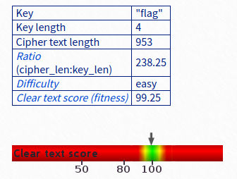

# la cifra de

## Problem

> I found this cipher in an old book. Can you figure out what it says? Connect with nc 2019shell1.picoctf.com 1172.

* [Program](./vuln)
* [Source](./vuln.c)

## Solution

1. Output of `nc 2019shell1.picoctf.com 1172`:

    ```
    Encrypted message:
    Ne iy nytkwpsznyg nth it mtsztcy vjzprj zfzjy rkhpibj nrkitt ltc tnnygy ysee itd tte cxjltk

    Ifrosr tnj noawde uk siyyzre, yse Bnretèwp Cousex mls hjpn xjtnbjytki xatd eisjd

    Iz bls lfwskqj azycihzeej yz Brftsk ip Volpnèxj ls oy hay tcimnyarqj dkxnrogpd os 1553 my Mnzvgs Mazytszf Merqlsu ny hox moup Wa inqrg ipl. Ynr. Gotgat Gltzndtg Gplrfdo 

    Ltc tnj tmvqpmkseaznzn uk ehox nivmpr g ylbrj ts ltcmki my yqtdosr tnj wocjc hgqq ol fy oxitngwj arusahje fuw ln guaaxjytrd catizm tzxbkw zf vqlckx hizm ceyupcz yz tnj fpvjc hgqqpohzCZK{m311a50_0x_a1rn3x3_h1ah3xflc148k7}

    Yse lncsz bplr-izcarpnzjo dkxnroueius zf g uzlefwpnfmeznn cousex mzwkapr, cfd mgip axtfnj 1467 gj Lkty Bgyeiyyl Argprzn.

    Ehk Atgksèce Inahkw ts zmprkkzrk xzmkytmkx narqpd zmp Argprzn Oiyh zr Gqmexyt Cousex.

    Ny 1508, Jumlntjd Txnehkrtuy nyvkseej yse yt-narqpd zfmurf ceiyl (a sferoc zf ymtfzjo arusahjes) zmlt ctflj qltkw me g hciznnar hzmvtyety zf zmp Volpnèxj Nivmpr.

    Hjwlgxz’s yjnoti moupwez fapkfcej ny 1555 ay f notytnafeius zf zmp fowdt. Zmp lubpr nfwvkx zf zmp arusahjes gwp nub dhokeej wpgaqlrrd, muz yse gqahggpty fyd zmp itipx rjetkwd axj xidjo be rpatx zf g ryestyii ppy vmcayj, hhohs cgs me jnqfkwpnz bttn jlcn hzrxjdpusoety.
    ```

2. [guballa.de](https://www.guballa.de/vigenere-solver) is great at breaking Vigenère ciphers without knowing the key.

    The result:

    ```
    It is interesting how in history people often receive credit for things they did not create

    During the course of history, the Vigenère Cipher has been reinvented many times

    It was falsely attributed to Blaise de Vigenère as it was originally described in 1553 by Giovan Battista Bellaso in his book La cifra del. Sig. Giovan Battista Bellaso

    For the implementation of this cipher a table is formed by sliding the lower half of an ordinary alphabet for an apparently random number of places with respect to the upper halfpicoCTF{b311a50_0r_v1gn3r3_c1ph3raac148e7}

    The first well-documented description of a polyalphabetic cipher however, was made around 1467 by Leon Battista Alberti.

    The Vigenère Cipher is therefore sometimes called the Alberti Disc or Alberti Cipher.

    In 1508, Johannes Trithemius invented the so-called tabula recta (a matrix of shifted alphabets) that would later be a critical component of the Vigenère Cipher.

    Bellaso’s second booklet appeared in 1555 as a continuation of the first. The lower halves of the alphabets are now shifted regularly, but the alphabets and the index letters are mixed by means of a mnemonic key phrase, which can be different with each correspondent.
    ```

3. The flag is found at the end of the 4th line of output. 

### Flag

`picoCTF{b311a50_0r_v1gn3r3_c1ph3raac148e7}`
