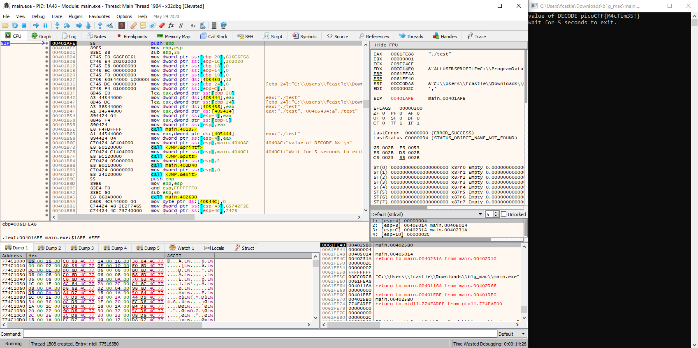

# B1g_Mac

## Problem

> Here's a zip file. You can also find the file in /problems/b1g-mac_0_ac4b0dbedcd3b0f0097a5f056e04f97a.

* [ZIP File](./b1g_mac.zip)

## Solution

1. Unzip `b1g_mac.zip` with `unzip b1g_mac.zip` to get a folder called `test` (with 18 images inside) and a `main.exe` executable file.
2. Running the `main.exe` file produces `No flag found, please make sure this is run on the server`, which is an interesting error message because this file cannot be run on the shell server since it is a Windows executable and the shell server runs Linux.
3. Creating a fake flag file with `echo picoCTF{fake_flag} > flag.txt` and rerunning the program results in the following:

    ```
    Work is done!
    Wait for 5 seconds to exit.
    ```

4. Since something happened lets see if the files are any different by re-extracting the test directory from the zip file and comparing it to the contents of the current test directory: `diff -r test/ test_original/`. Nothing appears to have changed. Lets reset the `test` directory and delete the "new" folder in case it actually changed something.
5. Reverse the binary file using [Ghidra](https://ghidra-sre.org/) ([cheat sheet](https://ghidra-sre.org/CheatSheet.html)). Open it and in the symbol tree click on main. The decompiled main function will show on the right.

    ```c++
    int __cdecl _main(int _Argc,char **_Argv,char **_Env)

    {
    undefined4 local_60;
    undefined local_5a [50];
    undefined4 local_28;
    undefined4 local_24;
    undefined4 local_20;
    size_t local_1c;
    FILE *local_18;
    int local_14;

    ___main();
    _isOver = 0;
    local_28 = 0x65742f2e;
    local_24 = 0x7473;
    local_20 = 0;
    _folderName = &local_28;
    local_14 = 0;
    _pLevel = 0;
    local_18 = _fopen("flag.txt","r");
    if (local_18 == (FILE *)0x0) {
        _puts("No flag found, please make sure this is run on the server");
    }
    local_1c = _fread(local_5a,1,0x12,local_18);
    if ((int)local_1c < 1) {
                        /* WARNING: Subroutine does not return */
        _exit(0);
    }
    _flag = local_5a;
    _flag_size = 0x12;
    local_60 = 0;
    _flag_index = &local_60;
    _puts("Work is done!");
    _listdir(local_14,_folderName);
    _puts("Wait for 5 seconds to exit.");
    _sleep(5);
    return 2;
    }
    ```

6. The program opens the flag file, reads 18 characters, initializes some globals and then calls `_listdir` (after printing `"Work is done!"` which is strange because nothing much is done before that message is printed). `_listdir` function:

    ```c++
    void __cdecl _listdir(int param_1,undefined4 param_2)

    {
    int iVar1;
    BOOL BVar2;
    CHAR local_958 [2048];
    _WIN32_FIND_DATAA local_158;
    HANDLE local_18;
    bool local_11;
    int local_10;
    
    local_18 = (HANDLE)0x0;
    _sprintf(local_958,"%s\\*.*",param_2);
    local_18 = FindFirstFileA(local_958,(LPWIN32_FIND_DATAA)&local_158);
    if (local_18 == (HANDLE)0xffffffff) {
        _printf("Path not found: [%s]\n",param_2);
    }
    else {
        local_10 = 1;
        local_11 = true;
        while (local_11 != false) {
        iVar1 = _strcmp(local_158.cFileName,".");
        if ((iVar1 != 0) && (iVar1 = _strcmp(local_158.cFileName,".."), iVar1 != 0)) {
            _sprintf(local_958,"%s\\%s",param_2,local_158.cFileName);
            if ((local_158.dwFileAttributes & 0x10) == 0) {
            if (local_10 == 1) {
                if (param_1 == 0) {
                _hideInFile(local_958);
                }
                else {
                if (param_1 == 1) {
                    _decodeBytes(local_958);
                }
                }
            }
            local_10 = 1 - local_10;
            }
            else {
            _printf("Folder: %s\n",local_958);
            _listdir(param_1,local_958);
            }
        }
        if (_isOver != '\0') break;
        BVar2 = FindNextFileA(local_18,(LPWIN32_FIND_DATAA)&local_158);
        local_11 = BVar2 != 0;
        }
        FindClose(local_18);
    }
    return;
    }
    ```

7. `_listdir` is a recursive function which iterates over files in the folder (it was called with the folder `"./test"` by the main function) and, if `param_1` if 0, it calls _hideInFile for every other file (only the `'Copy'` files). If `param_1` is set to 1,  `_decodeBytes` is called on the file instead.
8. Right click `_listdir` and go to "References > Find references to _listdir". One of the three options is an uncalled function labeled `_decode`:

    ```c++
    void UndefinedFunction_00401afe(void)

    {
    undefined4 uStack40;
    undefined4 uStack36;
    undefined4 uStack32;
    undefined4 uStack28;
    undefined4 uStack24;
    undefined4 uStack20;
    undefined4 uStack16;
    
    uStack36 = 0x616c6f68;
    uStack32 = 0x202020;
    uStack28 = 0;
    uStack24 = 0;
    uStack20 = 0;
    _buff_size = 0x12;
    uStack40 = 0;
    uStack16 = 1;
    _buff = &uStack36;
    _buff_index = &uStack40;
    _listdir(1,_folderName);
    _printf("value of DECODE %s \n",_buff);
    _puts("Wait for 5 seconds to exit.");
    _sleep(5);
                        /* WARNING: Subroutine does not return */
    _exit(0);
    }
    ```

9. The `_decode` function uses the same `_folderName` global variable as the main function. We can call `_decode_` using the debugger after `_folderName` gets initialized in the main function.
10. Get location in main right after initializing `_folderName`: `0x00401bda`

    ```
    00401bc1 c7 44 24        MOV        dword ptr [ESP + local_20],0x0
                50 00 00 
                00 00
    00401bc9 8d 44 24 48     LEA        EAX=>local_28,[ESP + 0x48]
    00401bcd a3 34 54        MOV        [_folderName],EAX                                = ??
                40 00
    00401bd2 c7 44 24        MOV        dword ptr [ESP + local_14],0x0
                5c 00 00 
                00 00
    00401bda c7 05 48        MOV        dword ptr [_pLevel],0x31                         = ??
                54 40 00 
                31 00 00 00
    ```

11. Get address of `_decode`: `0x00401afe`

    ```
                                 LAB_00401afc                                    XREF[1]:     004019bd(j)  
        00401afc c9              LEAVE
        00401afd c3              RET
                             _decode
        00401afe 55              PUSH       EBP
        00401aff 89 e5           MOV        EBP,ESP
        00401b01 83 ec 38        SUB        ESP,0x38
        00401b04 c7 45 e0        MOV        dword ptr [EBP + -0x20],0x616c6f68
                 68 6f 6c 61
        00401b0b c7 45 e4        MOV        dword ptr [EBP + -0x1c],0x202020
                 20 20 20 00
    ```

12. Debugger and Get Flag
    1. Linux (`winedbg` - did not work): Open in GDB with `winedbg main.exe` then set a breakpoint at `0x00401bda` with `break *0x00401bda` (the `*` means "address" instead of function) then `next` then `set $eip = 0x00401afe` then `next` and get the flag.
    2. Windows (`x32dbg` - Successful): It is important that the file times in the zip are not changed. On Windows, use `7-zip` to open and extract these files without modifying their file times. The built-in to Windows extraction option does not work. Run `x96dbg` from [x64dbg](https://x64dbg.com/) and select `x32dbg`. Then open `main.exe` in `x32dbg` and run `SetBPX 00401bda` to set a breakpoint at `0x00401bda`. Next, click through "run" until this breakpoint is reached. When the breakpoint is hit, run `EIP=00401afe` to change the `EIP` to `_decode`. "Run" one more time and get the flag.

    ```
    value of DECODE picoCTF{M4cTim35!}
    Wait for 5 seconds to exit.
    ```

    

13. `_hideInFile` function:

    ```c++
    void __cdecl _hideInFile(LPCSTR param_1)

    {
    BOOL BVar1;
    FILETIME local_2c;
    FILETIME local_24;
    FILETIME local_1c;
    char local_12;
    char local_11;
    HANDLE local_10;
    
    local_10 = CreateFileA(param_1,0x100,0,(LPSECURITY_ATTRIBUTES)0x0,3,0,(HANDLE)0x0);
    _DoNotUpdateLastAccessTime(local_10);
    if (local_10 == (HANDLE)0xffffffff) {
        _printf("Error:INVALID_HANDLED_VALUE");
    }
    else {
        BVar1 = GetFileTime(local_10,(LPFILETIME)&local_1c,(LPFILETIME)&local_24,(LPFILETIME)&local_2c);
        if (BVar1 == 0) {
        _printf("Error: C-GFT-01");
        }
        else {
        local_11 = *(char *)(*_flag_index + _flag);
        *_flag_index = *_flag_index + 1;
        local_12 = *(char *)(*_flag_index + _flag);
        *_flag_index = *_flag_index + 1;
        _encodeBytes(local_11,local_12,(uint *)&local_2c);
        if (0 < _pLevel) {
            local_11 = *(char *)(*_flag_index + _flag);
            *_flag_index = *_flag_index + 1;
            local_12 = *(char *)(*_flag_index + _flag);
            *_flag_index = *_flag_index + 1;
            _encodeBytes(local_11,local_12,(uint *)&local_1c);
        }
        if (_pLevel == 2) {
            local_11 = *(char *)(*_flag_index + _flag);
            *_flag_index = *_flag_index + 1;
            local_12 = *(char *)(*_flag_index + _flag);
            *_flag_index = *_flag_index + 1;
            _encodeBytes(local_11,local_12,(uint *)&local_24);
        }
        BVar1 = SetFileTime(local_10,&local_1c,&local_24,&local_2c);
        if (BVar1 == 0) {
            _printf("Error: C-SFT-01");
        }
        else {
            if (_flag_size <= *_flag_index) {
            _isOver = 1;
            }
            CloseHandle(local_10);
        }
        }
    }
    return;
    }
    ```

    We can see that the function is using `GetFileTime` and `SetFileTime`, and this also explains the challenge name ([MAC](https://en.wikipedia.org/wiki/MAC_times) stands for "Modification, Access, Creation"). The Windows user interface shows us the date and H:M:S, but NTFS file systems have a resolution of 100 Nanoseconds for these fields (The `FILETIME` structure represents the time in 100-nanosecond intervals since January 1, 1601). More info about how the flag was encoded and how to write a script to decode it: [Dvd848](https://github.com/Dvd848/CTFs/blob/master/2019_picoCTF/B1g_Mac.md) ([Archive](https://web.archive.org/web/20200604043315/https://github.com/Dvd848/CTFs/blob/master/2019_picoCTF/B1g_Mac.md)) and [AMACB](https://github.com/AMACB/picoCTF-2019-writeups/tree/master/problems/B1g_Mac) ([Archive](https://web.archive.org/web/20200604043334/https://github.com/AMACB/picoCTF-2019-writeups/tree/master/problems/B1g_Mac))

### Flag

`picoCTF{M4cTim35!}`
