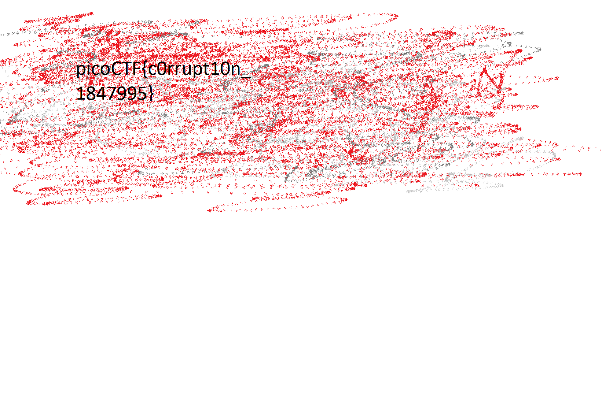

# c0rrupt

## Problem

> We found this file. Recover the flag. You can also find the file in /problems/c0rrupt_0_1fcad1344c25a122a00721e4af86de13.

* [The File](./mystery)

## Solution

1. Checking the `file mystery` indicates nothing. However, viewing the `head` of the mystery file shows it looks like a PNG image:

    ```
    $ xxd -g 1 mystery | head
    00000000: 89 65 4e 34 0d 0a b0 aa 00 00 00 0d 43 22 44 52  .eN4........C"DR
    00000010: 00 00 06 6a 00 00 04 47 08 02 00 00 00 7c 8b ab  ...j...G.....|..
    00000020: 78 00 00 00 01 73 52 47 42 00 ae ce 1c e9 00 00  x....sRGB.......
    00000030: 00 04 67 41 4d 41 00 00 b1 8f 0b fc 61 05 00 00  ..gAMA......a...
    00000040: 00 09 70 48 59 73 aa 00 16 25 00 00 16 25 01 49  ..pHYs...%...%.I
    00000050: 52 24 f0 aa aa ff a5 ab 44 45 54 78 5e ec bd 3f  R$......DETx^..?
    00000060: 8e 64 cd 71 bd 2d 8b 20 20 80 90 41 83 02 08 d0  .d.q.-.  ..A....
    00000070: f9 ed 40 a0 f3 6e 40 7b 90 23 8f 1e d7 20 8b 3e  ..@..n@{.#... .>
    00000080: b7 c1 0d 70 03 74 b5 03 ae 41 6b f8 be a8 fb dc  ...p.t...Ak.....
    00000090: 3e 7d 2a 22 33 6f de 5b 55 dd 3d 3d f9 20 91 88  >}*"3o.[U.==. ..
    ```

2. The [PNG Specification](https://www.w3.org/TR/2003/REC-PNG-20031110/) tells that the [PNG signature](https://www.w3.org/TR/2003/REC-PNG-20031110/#5PNG-file-signature) (first eight bytes of a PNG datastream) must be `137 80 78 71 13 10 26 10` (decimal) or `89 50 4E 47 0D 0A 1A 0A` (hex).
3. So lets replace the signature using [a hex editor](https://hexed.it/):

    ```
    $ xxd -g 1 mystery.png | head
    00000000: 89 50 4e 47 0d 0a 1a 0a 00 00 00 0d 43 22 44 52  .PNG........C"DR
    00000010: 00 00 06 6a 00 00 04 47 08 02 00 00 00 7c 8b ab  ...j...G.....|..
    00000020: 78 00 00 00 01 73 52 47 42 00 ae ce 1c e9 00 00  x....sRGB.......
    00000030: 00 04 67 41 4d 41 00 00 b1 8f 0b fc 61 05 00 00  ..gAMA......a...
    00000040: 00 09 70 48 59 73 aa 00 16 25 00 00 16 25 01 49  ..pHYs...%...%.I
    00000050: 52 24 f0 aa aa ff a5 ab 44 45 54 78 5e ec bd 3f  R$......DETx^..?
    00000060: 8e 64 cd 71 bd 2d 8b 20 20 80 90 41 83 02 08 d0  .d.q.-.  ..A....
    00000070: f9 ed 40 a0 f3 6e 40 7b 90 23 8f 1e d7 20 8b 3e  ..@..n@{.#... .>
    00000080: b7 c1 0d 70 03 74 b5 03 ae 41 6b f8 be a8 fb dc  ...p.t...Ak.....
    00000090: 3e 7d 2a 22 33 6f de 5b 55 dd 3d 3d f9 20 91 88  >}*"3o.[U.==. ..
    ```

4. After the header come a series of chunks. Each chunk starts with 4 bytes for the length of the chunk, 4 bytes for the type, then the chunk content itself (with the length declared earlier) and 4 bytes of a checksum. See the "5.3 Chunk layout" section of [this page](https://www.w3.org/TR/2003/REC-PNG-20031110/#5Chunk-layout) for more information.
5. The first chunk is called `IHDR` and has the length of `0xD`, so we know that the next 8 bytes are `00 00 00 0D 49 48 44 52` (hex):

    ```
    $ xxd -g 1 mystery.png | head
    00000000: 89 50 4e 47 0d 0a 1a 0a 00 00 00 0d 49 48 44 52  .PNG........IHDR
    00000010: 00 00 06 6a 00 00 04 47 08 02 00 00 00 7c 8b ab  ...j...G.....|..
    00000020: 78 00 00 00 01 73 52 47 42 00 ae ce 1c e9 00 00  x....sRGB.......
    00000030: 00 04 67 41 4d 41 00 00 b1 8f 0b fc 61 05 00 00  ..gAMA......a...
    00000040: 00 09 70 48 59 73 aa 00 16 25 00 00 16 25 01 49  ..pHYs...%...%.I
    00000050: 52 24 f0 aa aa ff a5 ab 44 45 54 78 5e ec bd 3f  R$......DETx^..?
    00000060: 8e 64 cd 71 bd 2d 8b 20 20 80 90 41 83 02 08 d0  .d.q.-.  ..A....
    00000070: f9 ed 40 a0 f3 6e 40 7b 90 23 8f 1e d7 20 8b 3e  ..@..n@{.#... .>
    00000080: b7 c1 0d 70 03 74 b5 03 ae 41 6b f8 be a8 fb dc  ...p.t...Ak.....
    00000090: 3e 7d 2a 22 33 6f de 5b 55 dd 3d 3d f9 20 91 88  >}*"3o.[U.==. ..
    ```

6. Now the file is identified as a PNG file:

    ```
    $ file fixed.png
    fixed.png: PNG image data, 1642 x 1095, 8-bit/color RGB, non-interlaced
    ```

7. `pngcheck` lists two more errors to solve:

    ```
    pngcheck -vf mystery.png
    File: mystery.png (202940 bytes)
    chunk IHDR at offset 0x0000c, length 13
        1642 x 1095 image, 24-bit RGB, non-interlaced
    chunk sRGB at offset 0x00025, length 1
        rendering intent = perceptual
    chunk gAMA at offset 0x00032, length 4: 0.45455
    chunk pHYs at offset 0x00042, length 9: 2852132389x5669 pixels/meter
    CRC error in chunk pHYs (computed 38d82c82, expected 495224f0)
    :  invalid chunk length (too large)
    ```

    We need to fix the CRC (checksum) error in chunk `pHYs` and find a chunk with an invalid length.

8. The CRC error means that either the checksum (CRC value) is corrupted, or the data is. To solve this error in chunk `pHYs` we can simply replace the CRC (expected) value with the computed value. The purpose of the CRC section is to check for corruption of the data. It essentially is a checksum of that chunk. While replacing the CRC will work, the more "correct" method is to correct the content of `pHYs` in order to get the same CRC, thus fixing the corruption that occurred. The below table shows the layout of the `pHYs` chunk:

    | Name                    | Length                         | Current Value |
    |-------------------------|--------------------------------|---------------|
    | Pixels per unit, X axis | 4 bytes (PNG unsigned integer) | aa 00 16 25   |
    | Pixels per unit, Y axis | 4 bytes (PNG unsigned integer) | 00 00 16 25   |
    | Unit specifier          | 1 byte                         | 01            |

    Since the pixels per unit differ in just one byte, and the `0xaa` for the X axis makes the value very large, it makes sense to place a zero instead. This fixes the checksum.

    ```
    $ xxd -g 1 mystery.png | head
    00000000: 89 50 4e 47 0d 0a 1a 0a 00 00 00 0d 49 48 44 52  .PNG........IHDR
    00000010: 00 00 06 6a 00 00 04 47 08 02 00 00 00 7c 8b ab  ...j...G.....|..
    00000020: 78 00 00 00 01 73 52 47 42 00 ae ce 1c e9 00 00  x....sRGB.......
    00000030: 00 04 67 41 4d 41 00 00 b1 8f 0b fc 61 05 00 00  ..gAMA......a...
    00000040: 00 09 70 48 59 73 00 00 16 25 00 00 16 25 01 49  ..pHYs...%...%.I
    00000050: 52 24 f0 aa aa ff a5 ab 44 45 54 78 5e ec bd 3f  R$......DETx^..?
    00000060: 8e 64 cd 71 bd 2d 8b 20 20 80 90 41 83 02 08 d0  .d.q.-.  ..A....
    00000070: f9 ed 40 a0 f3 6e 40 7b 90 23 8f 1e d7 20 8b 3e  ..@..n@{.#... .>
    00000080: b7 c1 0d 70 03 74 b5 03 ae 41 6b f8 be a8 fb dc  ...p.t...Ak.....
    00000090: 3e 7d 2a 22 33 6f de 5b 55 dd 3d 3d f9 20 91 88  >}*"3o.[U.==. ..
    ```

    ```
    $ pngcheck -v -f mystery.png
    File: fixed.png (202940 bytes)
    chunk IHDR at offset 0x0000c, length 13
        1642 x 1095 image, 24-bit RGB, non-interlaced
    chunk sRGB at offset 0x00025, length 1
        rendering intent = perceptual
    chunk gAMA at offset 0x00032, length 4: 0.45455
    chunk pHYs at offset 0x00042, length 9: 5669x5669 pixels/meter (144 dpi)
    :  invalid chunk length (too large)
    ERRORS DETECTED in fixed.png
    ```

9. The `invalid chunk length (too large)` error does not specify a chunk, so we must begin at the start and check each chunk, with the knowledge of the format of chunks and each field’s length: 4 bytes (length) - 4 bytes (chunk type) - lengthbytes (data) - 4 bytes (CRC).
10. The chunk after `pHYs` has a size of `0xaaaaffa5`, which is very large, and a type of `\xabDET` which doesn't exist. The closest chunk type is [IDAT](https://www.w3.org/TR/2003/REC-PNG-20031110/#11IDAT). Let's fix that by replaying the chunk name with `49 44 41 54` (hex).
11. To solve the large chunk length we need to calculate the chunk length and update its value. `IDAT` chunks must be consecutive so lets find the next one. We find the next IDAT at offset `0x10008`. The first IDAT was at offset `0x57`. The difference is FFB1. We must subtract 4 bytes for the length field of the second IDAT, subtract 4 bytes for the CRC of the first IDAT, and subtract 4 bytes again for the chunktype of the first IDAT. Subtracting 12 in total, we get FFA5. Replace the length field with `00 00 FF A5` (hex). The original value was `0xAAAAFFA5` so we just needed to overwrite the `AAAA` with `0000`.
12. Running `pngcheck mystery.png` shows `mystery.png (1642x1095, 24-bit RGB, non-interlaced, 96.3%).` which means there are no errors and we can open the image: 

### Flag

`picoCTF{c0rrupt10n_1847995}`
