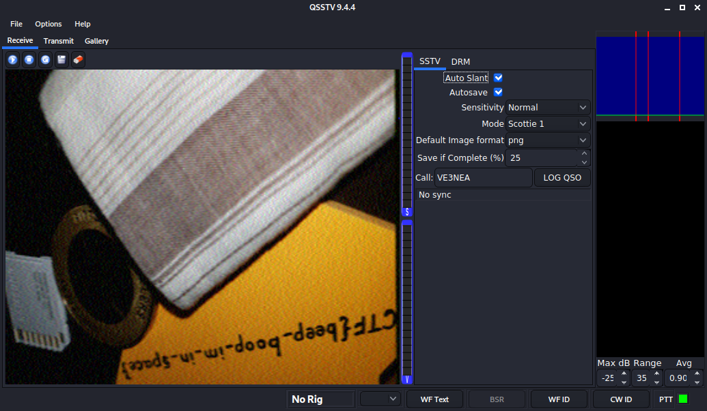

# m00nwalk

## Problem

> Decode this message from the moon. You can also find the file in /problems/m00nwalk_6_811c5485a374101cc212434dc2601130.

* [Message](./message.wav)

## Solution

1. The hint suggests that this is related to how images from the moon landing were transmitted back to earth. Some research leads to [SSTV](https://en.wikipedia.org/wiki/Slow-scan_television). Note: Originally I solved this challenge using [this program for Windows](http://users.belgacom.net/hamradio/rxsstv.htm) but since then I found an easier way that works within Kali Linux (see next step).
2. [This tutorial](https://ourcodeworld.com/articles/read/956/how-to-convert-decode-a-slow-scan-television-transmissions-sstv-audio-file-to-images-using-qsstv-in-ubuntu-18-04) ([Archive](https://web.archive.org/web/20200602003341/https://ourcodeworld.com/articles/read/956/how-to-convert-decode-a-slow-scan-television-transmissions-sstv-audio-file-to-images-using-qsstv-in-ubuntu-18-04)) explains how to convert the audio file to an image.
3. Install `qsstv` with `apt-get install qsstv`
4. Run `pactl load-module module-null-sink sink_name=virtual-cable`
5. Run `pavucontrol`. A GUI will pop-up, go to the "Output Devices" tab to verify that you have the "Null Output" device.
6. Run `qsstv`. The program GUI will pop-up, go to "Options" -> "Configuration" -> "Sound" and select the "PulseAudio" Audio Interface
7. Back in the `pavucontrol` GUI, select the "Recording" tab and specify that QSSTV should capture audio from the Null Output
8. The hint asked "What is the CMU mascot?" - the answer is "Scotty the Scottie Dog". This hinted that we should select "Scottie 1" as QSSTV's "Mode". Select "Auto Slant" as well.
9. Run `paplay -d virtual-cable message.wav` to create the image: 
10. Unload the virtual audio cable so audio will play normally:

    ```
    $ pactl list short modules | grep null
    25      module-null-sink        sink_name=virtual-cable
    $ pactl unload-module 25
    ```

### Flag

`picoCTF{beep_boop_im_in_space}`
