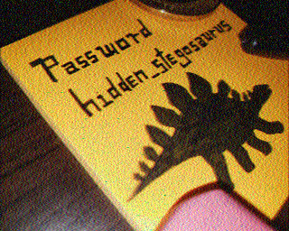
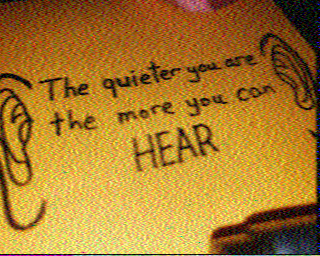
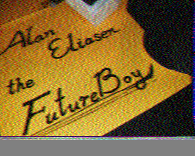

# m00nwalk 2

## Problem

> Revisit the last transmission. We think this transmission contains a hidden message. There are also some clues clue 1, clue 2, clue 3. You can also find the files in /problems/m00nwalk2_0_c513cbf9ae6c76876372b8e29826e77b.

* [Clue 1](clue1.wav)
* [Clue 2](clue2.wav)
* [Clue 3](clue3.wav)

## Solution

1. Decode the 3 clues using the same method from the first `m00nwalk` challenge except using the Auto  mode instead of "Scottie 1". "Martin 1", "Scottie 2", and "Martin 2" are the necessary modes for each clue respectively.
2. Three clues:

    
    
    

3. Searching for "Alan Eliasen the Future Boy" brings us to [this page](https://futureboy.us/stegano/), which talks about Steganography Tools.
4. Either the [decode page of the above site](https://futureboy.us/stegano/decinput.html) or `steghide` can be used to decode the original message and get the flag using the password from the first clue: `steghide extract -sf message.wav -p hidden_stegosaurus` then `cat steganopayload12154.txt`

### Flag

`picoCTF{the_answer_lies_hidden_in_plain_sight}`
