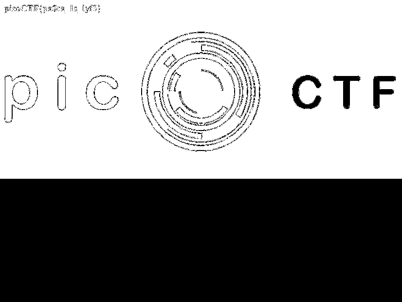
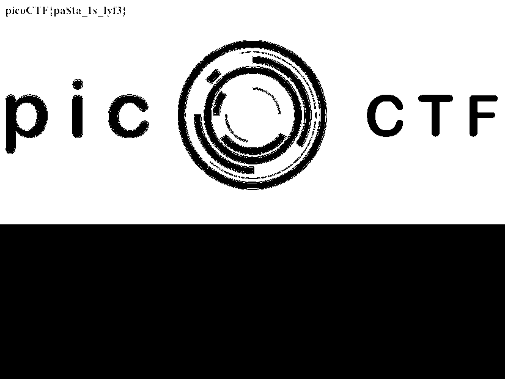

# pastaAAA

## Problem

> This pasta is up to no good. There MUST be something behind it.

* [Image](./ctf.png)

## Solution

1. Use the `stegsolve` tool to find the flag in red planes 0 and 1. `stegsolve` can be downloaded from [this GitHub repo](https://github.com/eugenekolo/sec-tools/blob/master/stego/stegsolve/stegsolve/stegsolve.jar). More stenography tools on [HackTricks](https://book.hacktricks.xyz/stego/stego-tricks).
2. Looking at both planes is important to find that the 3rd character of the flag is a dollar sign and not a capital S.

### Flag

`picoCTF{pa$ta_1s_lyf3}`
