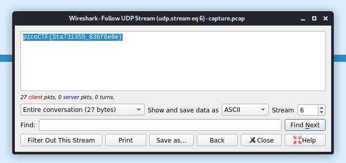

# shark on wire 1

## Problem

> We found this packet capture. Recover the flag. You can also find the file in /problems/shark-on-wire-1_0_13d709ec13952807e477ba1b5404e620.

* [Packet Capture](./capture.pcap)

## Solution

1. Open the ".pcap" file in wireshark.
2. Filter for the UDP streams since there was a hint about streams.
3. Apply the filter `udp.stream eq 6` then right-click a packet, select follow, then follow udp.

    

### Flag

`picoCTF{StaT31355_636f6e6e}`
