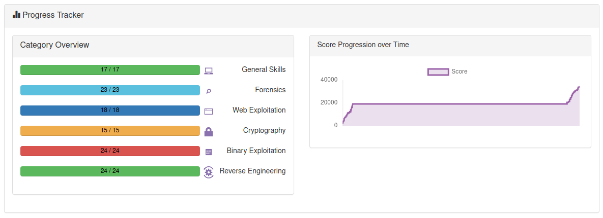

# HHousen PicoCTF-2019 Writeup

Write-ups for various challenges from the 2019 [picoCTF competition](https://2019game.picoctf.com/).

During the competition period, which was held between September 27, 2018 and October 11, 2019, I scored 13,900 points. Since then I have completed all the challenges and reached the max score of 34,201 points.

Not every challenge has a corresponding writeup. I did not do any writeups for any of the challenges in the "General Skills" category since they were mostly for beginners. I also left out many of the beginner-level challenges in other categories. All of the most difficult challenges with the fewest solves have a writeup.

