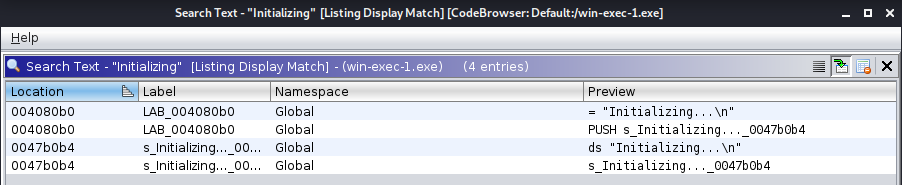
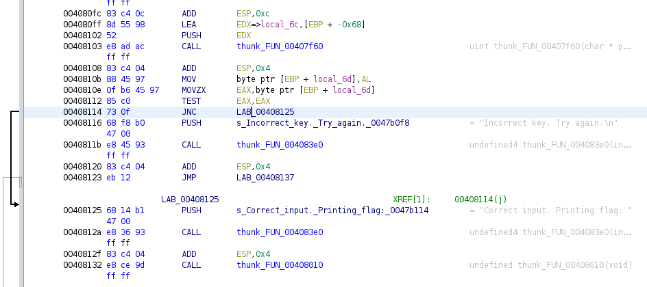
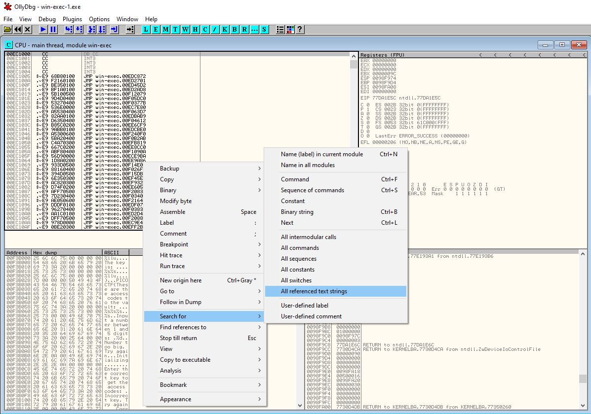
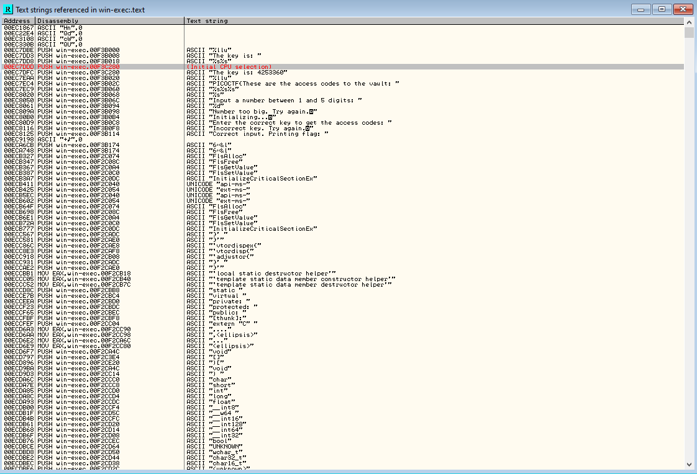

# B1ll_Gat35

## Problem

> Can you reverse this Windows Binary?

* [Program](./win-exec-1.exe)

## Solution

### Stage 1: Analysis

1. Reverse the binary file using [Ghidra](https://ghidra-sre.org/) ([cheat sheet](https://ghidra-sre.org/CheatSheet.html)). `main()` function:

    ```c++
    void FUN_00408040(void)

    {
    int iVar1;
    FILE *pFVar2;
    uint uVar3;
    int local_78;
    int local_74;
    char local_6c [100];
    uint local_8;

    local_8 = DAT_0047b174 ^ (uint)&stack0xfffffffc;
    thunk_FUN_004083e0((int)s_Input_a_number_between_1_and_5_d_0047b06c);
    thunk_FUN_00408430((int)&DAT_0047b094);
    local_74 = 1;
    while (9 < local_78) {
        local_74 = local_74 + 1;
        local_78 = local_78 / 10;
    }
    if (local_74 < 6) {
        thunk_FUN_004083e0((int)s_Initializing..._0047b0b4);
        thunk_FUN_00407ff0(local_78,local_74);
        do {
        iVar1 = thunk_FUN_00415840();
        } while (iVar1 != 10);
        thunk_FUN_004083e0((int)s_Enter_the_correct_key_to_get_the_0047b0c8);
        pFVar2 = (FILE *)___acrt_iob_func(0);
        thunk_FUN_004157db(local_6c,100,pFVar2);
        uVar3 = thunk_FUN_00407f60(local_6c);
        if ((char)uVar3 == '\0') {
        thunk_FUN_004083e0((int)s_Incorrect_key._Try_again._0047b0f8);
        }
        else {
        thunk_FUN_004083e0((int)s_Correct_input._Printing_flag:_0047b114);
        thunk_FUN_00408010();
        }
    }
    else {
        thunk_FUN_004083e0((int)s_Number_too_big._Try_again._0047b098);
    }
    thunk_FUN_004084bf();
    return;
    }
    ```

    I found `main()` by going to `Search > Program Text` and searching for `Initializing` in "All Fields" since that was a string that appears when the program launches. Clicking the one with the "PUSH" in the preview goes right to the `main()` function.

    

    This is difficult to read but `thunk_FUN_00407f60()` appears to validate the key. If this function returns 0 then the key is incorrect, otherwise the key is correct.

### Option 1: Patching the binary

In this option we rewrite a single character of the assembly of the program to run the code to print the flag even if the key is incorrect.

1. During the analysis stage we saw this `if else` block:

    ```c++
    pFVar2 = (FILE *)___acrt_iob_func(0);
    thunk_FUN_004157db(local_6c,100,pFVar2);
    uVar3 = thunk_FUN_00407f60(local_6c);
    if ((char)uVar3 == '\0') {
    thunk_FUN_004083e0((int)s_Incorrect_key._Try_again._0047b0f8);
    }
    else {
    thunk_FUN_004083e0((int)s_Correct_input._Printing_flag:_0047b114);
    thunk_FUN_00408010();
    }
    ```

    If the function that checks the key we input returns 0 then the key is incorrect and we don't get a flag. Let's change that so if it returns 0 it jumps to the else block instead. We can do this quite easily thanks to Ghidra.

2. We are looking for the line `00408114 75 0f           JNZ        LAB_00408125` in the assembly view. This can be easily found by clicking on the `if` of the if statement (which was discussed in step 1) in the decompiled view. This will highlight the correct line.
3. The line directly before the aforementioned line contains the `TEST` operation: `00408112 85 c0           TEST       EAX,EAX`.  What's important to know about the `TEST` operation is that it sets the flags `CF` and `OF` to zero. You can learn more on [its wikipedia entry](https://en.wikipedia.org/wiki/TEST_(x86_instruction)). [JNZ](https://www.aldeid.com/wiki/X86-assembly/Instructions/jnz) jumps to the specified location if the Zero Flag (ZF) is cleared (test for something not being equal). If we change the [`JNZ` operation](https://www.aldeid.com/wiki/X86-assembly/Instructions/jnz) to the `JNC` operation, which is true if `CF=0`, then we will skip right to the else block. Remember, the CF flag is always zero after the `TEST` operation so the else will always run. In fact, the decompiler view doesn't even show it anymore after we make the change, as you will see in the next step. More info about all the operators related to JNZ can be found [on this page](http://faydoc.tripod.com/cpu/jnz.htm).
4. The make the above change, right-click on the `JNZ` operator, choose "Patch Instruction", and change the `JNZ` to `JNC`. The decompiler view will update to the following:

    ```c++
    pFVar2 = (FILE *)___acrt_iob_func(0);
    thunk_FUN_004157db(local_6c,100,pFVar2);
    thunk_FUN_00407f60(local_6c);
    thunk_FUN_004083e0((int)s_Correct_input._Printing_flag:_0047b114);
    thunk_FUN_00408010();
    ```

    To recap, we changed the line from `00408114 75 0f           JNZ        LAB_00408125` to `00408114 75 0f           JNC        LAB_00408125`.

    

5. Next, we need to export the program from Ghidra. Go to `File > Export Program` and set the "Format" to "Binary". Select your desired save location and click "OK". Now rename the exported file from `win-exec-1.exe.bin` to `win-exec-1.exe` (remove the ".bin").
6. Now, we can just run the executable with `wine win-exec-1.exe` (modified executable: [win-exec-1_patched.exe](win-exec-1_patched.exe)):

    ```
    Input a number between 1 and 5 digits: 1
    Initializing...
    Enter the correct key to get the access codes: 1
    Correct input. Printing flag: PICOCTF{These are the access codes to the vault: 1063340}
    ```

### Option 2: Debugging to find the key

1. `thunk_FUN_00407f60()` function from Ghidra:

    ```c++
    uint __cdecl FUN_00407f60(char *param_1)

    {
    char *_Str;
    size_t sVar1;
    size_t sVar2;
    uint local_8;

    _Str = (char *)thunk_FUN_00407f40();
    local_8 = 0;
    while( true ) {
        sVar1 = _strlen(param_1);
        if (sVar1 - 1 <= local_8) {
        return CONCAT31((int3)(sVar1 - 1 >> 8),1);
        }
        sVar1 = _strlen(param_1);
        sVar2 = _strlen(_Str);
        if (sVar1 - 1 != sVar2) break;
        if (param_1[local_8] != _Str[local_8]) {
        return (uint)(_Str + local_8) & 0xffffff00;
        }
        local_8 = local_8 + 1;
    }
    return sVar2 & 0xffffff00;
    }
    ```

    `thunk_FUN_00407f40()` appears to get the key. This function points to `thunkFUN_00407e30()`, which references a global variable called `DAT_0047c280` with address `0x0047c280`. The last 4 values are the offset we want: `c280`.

2. Next, we open the program in [Ollydbg](http://www.ollydbg.de/). I pressed "Execute till return (Ctrl+F9)" and typed `1` in the program. Then, I hit "Pause execution (F12)", pressed the enter key, and then pressed "Execute till return (Ctrl+F9)" until the prompt for the key appeared. Now there are two options. You can disable ASLR on the binary using a method from [this StackOverflow answer](https://stackoverflow.com/questions/9560993/how-do-you-disable-aslr-address-space-layout-randomization-on-windows-7-x64) and then press CTRL+G and paste the offset, `0xc280`, we found. This will bring you to the value of the key. However, the easier option is to simply use the debugging step features and list all strings.
3. To do the second option, first make sure you are on the `win-exe` module (click "Show Modules window (Alt+E)" and choose `win-exe` to make sure) and then `right-click > Search for > All referenced text strings` as shown in the image below.

    

    You will see `The key is: 4253360` at `PUSH 0F3C280` (probably different first two characters because of ASLR).

    

4. Now just type the key into the program and hit enter to get the flag. Make sure to enter `The key is: 4253360`, not just `4253360`.

    ```
    Input a number between 1 and 5 digits: 1
    Initializing...
    Enter the correct key to get the access codes: The key is: 4253360
    Correct input. Printing flag: PICOCTF{These are the access codes to the vault: 1063340}
    ```

### Flag

`PICOCTF{These are the access codes to the vault: 1063340}`
