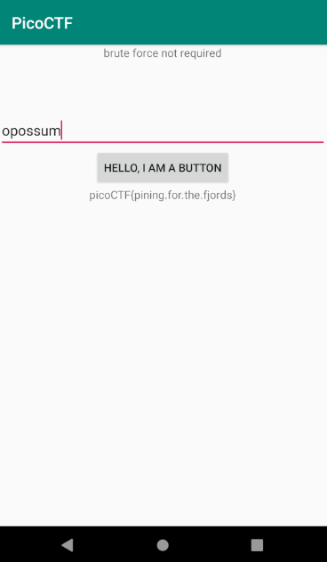

# droids1

## Problem

> Find the pass, get the flag. Check out this file. You can also find the file in /problems/droids1_0_b7f94e21c7e45e6604972f9bc3f50e24.

* [APK File](./one.apk)

## Solution

1. Decompile the APK using [apktool](https://ibotpeaches.github.io/Apktool), as suggested by the hint: `apktool d one.apk`:

    ```
    Picked up _JAVA_OPTIONS: -Dawt.useSystemAAFontSettings=on -Dswing.aatext=true
    I: Using Apktool 2.4.1-dirty on one.apk
    I: Loading resource table...
    I: Decoding AndroidManifest.xml with resources...
    I: Loading resource table from file: /home/kali/.local/share/apktool/framework/1.apk
    I: Regular manifest package...
    I: Decoding file-resources...
    I: Decoding values */* XMLs...
    I: Baksmaling classes.dex...
    I: Copying assets and libs...
    I: Copying unknown files...
    I: Copying original files...
    ```

    Alternatively, you can use [JADX](https://github.com/skylot/jadx) to decompile and look around in a GUI. This is the method used in this write-up.

    JADX Install:
    
    ```
    wget https://github.com/skylot/jadx/releases/download/v1.1.0/jadx-1.1.0.zip
    unzip jadx-1.1.0.zip -d jadx
    cd jadx
    sudo mkdir /opt/jadx
    sudo mv * /opt/jadx
    cd /opt/jadx/bin
    ./jadx-gui
    ```

2. Launch `jadx-gui` and open `one.apk`
3. In the `MainActivity` the button click code can be seen:

    ```java
    public void buttonClick(View view) {
        this.text_bottom.setText(FlagstaffHill.getFlag(this.text_input.getText().toString(), this.ctx));
    }
    ```

4. The `getFlag()` function is as follows:

    ```java
    public static String getFlag(String input, Context ctx) {
        if (input.equals(ctx.getString(R.string.password))) {
            return fenugreek(input);
        }
        return "NOPE";
    }
    ```

    It checks if the input is `R.string.password`, and if it matches then the flag is shown.

5. Go to `R > string > password` in the explorer to find `public static final int password = 2131427375;`. It is accessing resource `2131427375.
6. Go to `Resources > resources.arsc > res > values > strings.xml` since the password is probably a string. We find: `<string name="password">opossum</string>`
7. Start an AVD in [Android Studio](https://developer.android.com/studio). Install the app by dragging the APK to the emulator. Enter the password, `opossum`, and click the button to get the flag. 

### Flag

`picoCTF{pining.for.the.fjords}`
