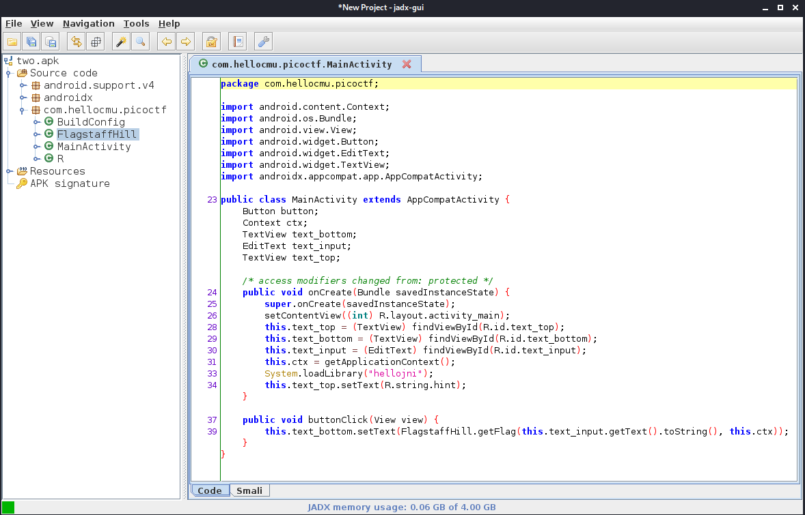
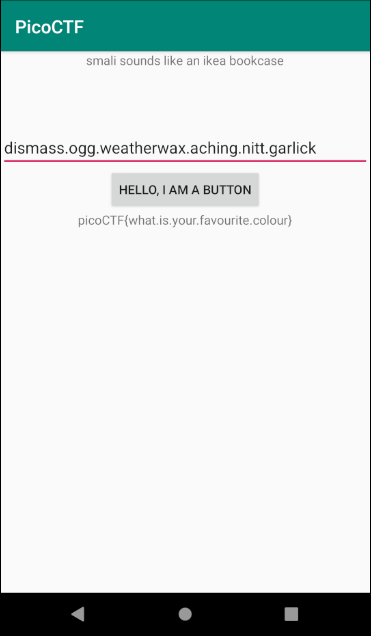

# droids2

## Problem

> Find the pass, get the flag. Check out this file. You can also find the file in /problems/droids2_0_bf474794b5a228db3498ba3198db54d7.

* [APK File](./two.apk)

## Solution

1. Use [JADX](https://github.com/skylot/jadx) to decompile and look around in a GUI. Launch `jadx-gui` and open `two.apk` 
2. In the `MainActivity` the button click code can be seen:

    ```java
    public void buttonClick(View view) {
        this.text_bottom.setText(FlagstaffHill.getFlag(this.text_input.getText().toString(), this.ctx));
    }
    ```

3. The `getFlag()` function is as follows:

    ```java
    public static String getFlag(String input, Context ctx) {
        String[] witches = {"weatherwax", "ogg", "garlick", "nitt", "aching", "dismass"};
        int second = 3 - 3;
        int third = (3 / 3) + second;
        int fourth = (third + third) - second;
        int fifth = 3 + fourth;
        if (input.equals("".concat(witches[fifth]).concat(".").concat(witches[third]).concat(".").concat(witches[second]).concat(".").concat(witches[(fifth + second) - third]).concat(".").concat(witches[3]).concat(".").concat(witches[fourth]))) {
            return sesame(input);
        }
        return "NOPE";
    }
    ```

    Reversing this logic means the password should be: `dismass.ogg.weatherwax.aching.nitt.garlick`

4. Start an AVD in [Android Studio](https://developer.android.com/studio). Install the app by dragging the APK to the emulator. Enter the password, `dismass.ogg.weatherwax.aching.nitt.garlick`, and click the button to get the flag. 

### Flag

`picoCTF{what.is.your.favourite.colour}`
