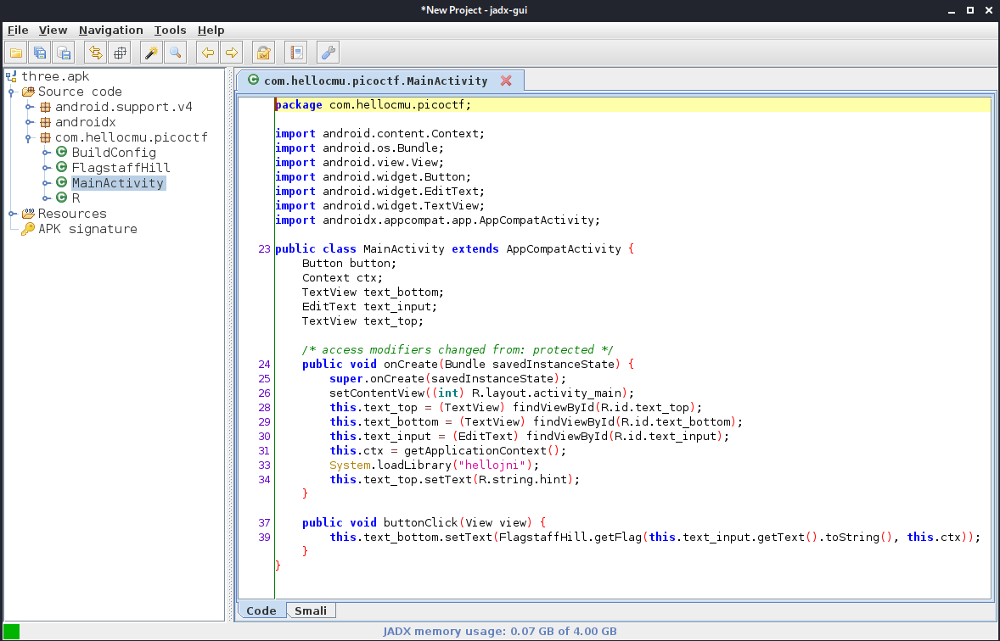
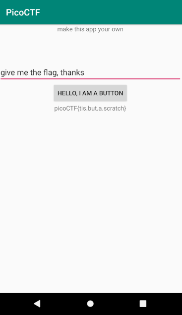

# droids3

## Problem

> Find the pass, get the flag. Check out this file. You can also find the file in /problems/droids3_0_b475775d8018b2a030a38c40e3b0e25c.

* [APK File](./three.apk)

## Solution

1. Use [JADX](https://github.com/skylot/jadx) to decompile and look around in a GUI. Launch `jadx-gui` and open `three.apk` 
2. The `FlagstaffHill` class (contains `getFlag()` function) is as follows:

    ```java
    public class FlagstaffHill {
        public static native String cilantro(String str);

        public static String nope(String input) {
            return "don't wanna";
        }

        public static String yep(String input) {
            return cilantro(input);
        }

        public static String getFlag(String input, Context ctx) {
            return nope(input);
        }
    }
    ```

    We can see that `getFlag()` calls `nope()`. `yep()` is never called. The `yep()` function most likely returns the flag.

3. Run `apktool d three.apk --no-res` to decompile without resources (decompiling resources was causing build errors).
4. Edit `three/smali/com/hellocmu/picoctf/FlagstaffHill.smali`: Change `invoke-static {p0}, Lcom/hellocmu/picoctf/FlagstaffHill;->nope(Ljava/lang/String;)Ljava/lang/String;` to `invoke-static {p0}, Lcom/hellocmu/picoctf/FlagstaffHill;->yep(Ljava/lang/String;)Ljava/lang/String;`
5. Rebuild the application: `apktool b three -o recompiled/recompiled_three.apk`
6. Use [patrickfav/uber-apk-signer](https://github.com/patrickfav/uber-apk-signer) [latest release](https://github.com/patrickfav/uber-apk-signer/releases/latest) to sign the app:

    ```
    wget https://github.com/patrickfav/uber-apk-signer/releases/download/v1.1.0/uber-apk-signer-1.1.0.jar
    java -jar uber-apk-signer-1.1.0.jar --apks recompiled
    ```

    This produces the `recompiled_three-aligned-debugSigned.apk` file, which can be installed.

7. Start an AVD in [Android Studio](https://developer.android.com/studio). Install the app by dragging the APK to the emulator. Enter any password and click the button to get the flag. 

### Flag

`picoCTF{tis.but.a.scratch}`
