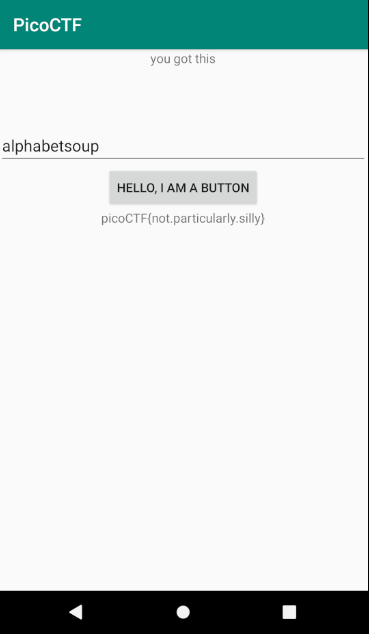

# droids4

## Problem

> reverse the pass, patch the file, get the flag. Check out this file. You can also find the file in /problems/droids4_0_99ba4f323d3d194b5092bf43d97e9ce9.

* [APK File](./three.apk)

## Solution

1. Use [JADX](https://github.com/skylot/jadx) to decompile and look around in a GUI. Launch `jadx-gui` and open `four.apk`
2. The `getFlag()` function is as follows:

    ```java
    public static String getFlag(String input, Context ctx) {
        StringBuilder ace = new StringBuilder("aaa");
        StringBuilder jack = new StringBuilder("aaa");
        StringBuilder queen = new StringBuilder("aaa");
        StringBuilder king = new StringBuilder("aaa");
        ace.setCharAt(0, (char) (ace.charAt(0) + 4));
        ace.setCharAt(1, (char) (ace.charAt(1) + 19));
        ace.setCharAt(2, (char) (ace.charAt(2) + 18));
        jack.setCharAt(0, (char) (jack.charAt(0) + 7));
        jack.setCharAt(1, (char) (jack.charAt(1) + 0));
        jack.setCharAt(2, (char) (jack.charAt(2) + 1));
        queen.setCharAt(0, (char) (queen.charAt(0) + 0));
        queen.setCharAt(1, (char) (queen.charAt(1) + 11));
        queen.setCharAt(2, (char) (queen.charAt(2) + 15));
        king.setCharAt(0, (char) (king.charAt(0) + 14));
        king.setCharAt(1, (char) (king.charAt(1) + 20));
        king.setCharAt(2, (char) (king.charAt(2) + 15));
        if (input.equals("".concat(queen.toString()).concat(jack.toString()).concat(ace.toString()).concat(king.toString()))) {
            return "call it";
        }
        return "NOPE";
    }
    ```

    We can copy this into our own java program. Run [password.java](password.java) to get the password without having to manually decode the logic. Password is `alphabetsoup`.

3. Run `apktool d four.apk --no-res` to decompile without resources (decompiling resources was causing build errors).
4. Edit `four/smali/com/hellocmu/picoctf/FlagstaffHill.smali`: Change `const-string v5, "call it"` to `invoke-static {p0}, Lcom/hellocmu/picoctf/FlagstaffHill;->cardamom(Ljava/lang/String;)Ljava/lang/String;`. This change was made to call the actual function that gives the flag. Add `move-result-object v0` directly after the previous change and replace `return-object v5` with `return-object v0`.

    I figured out the syntax by using the last challenge (`droids3`) as a model since it contained the following lines:

    ```
    invoke-static {p0}, Lcom/hellocmu/picoctf/FlagstaffHill;->cilantro(Ljava/lang/String;)Ljava/lang/String;

    move-result-object v0

    return-object v0
    ```

    In essence, replace this:

    ```
    const-string v5, "call it"

    return-object v5
    ```

    with this:

    ```
    invoke-static {p0}, Lcom/hellocmu/picoctf/FlagstaffHill;->cardamom(Ljava/lang/String;)Ljava/lang/String;

    move-result-object v0

    return-object v0
    ```

    Use the `cardamom` function to get the flag because this line `public static native String cardamom(String str);` exists within the `FlagstaffHill` class.

5. Rebuild the application: `apktool b four -o recompiled/recompiled_four.apk`
6. Use [patrickfav/uber-apk-signer](https://github.com/patrickfav/uber-apk-signer) [latest release](https://github.com/patrickfav/uber-apk-signer/releases/latest) to sign the app:

    ```
    wget https://github.com/patrickfav/uber-apk-signer/releases/download/v1.1.0/uber-apk-signer-1.1.0.jar
    java -jar uber-apk-signer-1.1.0.jar --apks recompiled
    ```

    This produces the `recompiled_four-aligned-debugSigned.apk` file, which can be installed.

7. Start an AVD in [Android Studio](https://developer.android.com/studio). Install the app by dragging the APK to the emulator. Enter the password, `alphabetsoup`, and click the button to get the flag. 

### Flag

`picoCTF{not.particularly.silly}`

## Alternative Solution

1. Create an AVD in Android Studio through the AVD Manager that does not have the Play Store. I selected the Pixel 2, clicked "Clone Device...", and then hit "Finish" which created a device named "Pixel 2 (Edited)" without the icon in the Play Store category. Virtual devices without the Play Store can be rooted while those with it can not be easily rooted.
2. ADB is located at `~/Android/Sdk/platform-tools/adb` on linux. See this [StackOverflow Answer](https://android.stackexchange.com/a/94049) for other OS's.
3. Install Frida on the virtual device by following [their tutorial](https://frida.re/docs/android/). Download the latest release from their [releases page](https://github.com/frida/frida/releases). I downloaded `frida-server-12.9.7-android-x86.xz` because my virtual device is `x86`. This can be determiend by clicking the more options arrow in the AVD Manager and clicking "View Details".

    Decompress it with `unxz frida-server.xz`, then run the following:

    ```
    $ ~/Android/Sdk/platform-tools/adb -s emulator-5556 root # might be required
    $ ~/Android/Sdk/platform-tools/adb -s emulator-5556 push frida-server /data/local/tmp/
    $ ~/Android/Sdk/platform-tools/adb -s emulator-5556 shell "chmod 755 /data/local/tmp/frida-server"
    $ ~/Android/Sdk/platform-tools/adb -s emulator-5556 shell "/data/local/tmp/frida-server &"
    $ adb devices -l
    ```

4. Install Frida on your host OS with `pip install frida-tools` ([detailed instructions](https://frida.re/docs/installation/)).
5. Run `frida-ps -U` on your desktop to make sure everything is working. This should give you a process list.
6. Install `four.apk` by dragging it onto the emulator.
7. Use [frida.js](frida.js) to inject a modified `getFlag()` function into the running process. The script was built using the [tutorial from Josh Spicer](https://joshspicer.com/android-frida-1). The command is `frida -U -l frida.js -f com.hellocmu.picoctf`. Then run `%resume` to let the main thread start executing. Next, enter the password, `alphabetsoup`, and click the button to get the flag.

    ```
    Spawned `com.hellocmu.picoctf`. Use %resume to let the main thread start executing!
    [Android Emulator 5556::com.hellocmu.picoctf]-> %resume
    [Android Emulator 5556::com.hellocmu.picoctf]-> Injecting new getFlag()...
    Entered getFlag() function
    GOT FLAG: picoCTF{not.particularly.silly}
    ```

### Flag

`picoCTF{not.particularly.silly}`